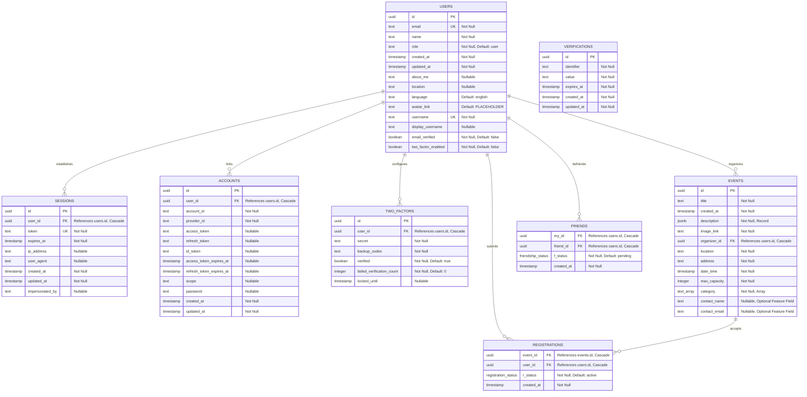

_This project has been created as part of the 42 curriculum by mde-krui, diwalaku, ccraciun, rtorrent._

# ft_transcendence (Eventra)

## 1. Description

Eventra is a multi-user event platform. Visitors browse, filter, sort and page through
upcoming events. Registered users get tickets for events with limited capacity, create and
manage their own events, keep a profile with an avatar, add friends, see who is online and
talk in a live chat. Administrators manage every user and event from a dashboard. A new
event, a sold-out ticket, a friend coming online or a chat message reaches every open
browser without a reload.

What the application does:

- Public event catalogue with category filters, three sort orders and server-side pagination.
- Accounts with e-mail and password sign-up, password reset (15-minute token expiry), and optional two-factor authentication (TOTP enrolment, QR codes, backup keys, and verification gates).
- Accounts with e-mail and password sign-up, password reset and optional two-factor authentication.
- Ticket registration with a capacity guarantee. A user holds at most one active ticket per event and an event never sells more tickets than its capacity.
- Event creation and editing for organisers, with a "My events" page and a "My tickets" page.
- Profiles with avatar upload, about and location fields and a preferred language.
- Friends with requests and acceptance, live online status and a global chat.
- A notification on every create, update and delete. The person acting sees a toast, the people affected receive an e-mail (welcome, ticket confirmation, event modified, event cancelled, 24-hour friendly reminder) in their language.
- Admin dashboard with a user table, role changes and a table of all events.
- Interface in English, Dutch and Spanish, switchable in the app and remembered per user.
- Server-side rendering, HTTPS for every request and a single-command Docker deployment.

---

## 2. Team information

| Role                       | Login      | Responsibilities                                                                                    |
| -------------------------- | ---------- | --------------------------------------------------------------------------------------------------- |
| Product Owner              | `diwalaku` | Product vision, backlog priorities, acceptance criteria, validation of finished work.               |
| Project Manager            | `ccraciun` | Coordination, blockers, milestones and timelines, keeping the team in sync.                         |
| Technical Lead / Architect | `mde-krui` | Stack decisions, code-quality standards, pull-request reviews, architecture across the three tiers. |

All four members are developers. Main areas per member:

| Login       | Main areas                                                                                                                                                                                          |
| ----------- | --------------------------------------------------------------------------------------------------------------------------------------------------------------------------------------------------- |
| `mde-krui`  | Monorepo and tooling, NestJS and tRPC backend architecture, authentication wiring, admin dashboard, profile persistence, Spanish locale.                                                            |
| `diwalaku`  | Landing page and navigation, event catalogue (filters, sorting, pagination), event cards and detail page, ticket registration, accessibility fixes, Dutch locale, legal pages.                      |
| `ccraciun`  | Real-time layer (events, presence, chat), friends, avatar upload, HTTPS with Caddy, Docker deployment, browser-compatibility test suite, responsive layout.                                         |
| `rtorrent`  | Notification system (toasts, mailer, multilingual e-mail templates), "My tickets" page.                                                                                                             |
| `*dkolodze` | Two-factor authentication, early authentication work, project management, documentation. Was unable to continue with the project, but her completed contributions remain part of the final project. |

---

## 3. Project management

### Task management and tracking

The backlog lives on a [GitHub Projects board](https://github.com/users/milandekruijf/projects/3) with the columns Backlog, In Progress, Code Review and Done. The board holds the product spec broken down into tasks with estimates.

Every feature lives on its own branch and reaches `main` through a pull request that the tech lead reviews. Examples: #53 (event timezone), #64 (e-mail notifications), #65 (chat), #66 (landing page), #68 (profile persistence).

[CI](./.github/workflows/ci.yml) runs formatting, linting, type checks, unit tests and the production build on every pull request and on every push to `main`. A pre-commit hook runs the same checks on staged files.

The team keeps the [`docs/`](./docs/README.md) folder (stack, database, API, authentication, environment, i18n, browser support) in sync with the code. [`AGENTS.md`](./AGENTS.md) points contributors and tools to it.

### Team communication

The team's Slack group is the primary channel. Coordination was mostly asynchronous. Members announced blockers, deployment changes and environment changes there and paired ad hoc when integrating features. Technical discussion happened on pull requests and on the board cards.

---

## 4. Technical stack

Vite+ and Bun manage the monorepo, with the workspaces `apps/frontend`, `apps/backend`, `packages/schemas` and `packages/tsconfig`.

**Frontend.** [React 19](https://react.dev/) with [TanStack Start](https://tanstack.com/start) and [TanStack Router](https://tanstack.com/router). We chose it for file-based routing and server-side rendering on plain React and Vite, for type-safe search parameters (the catalogue's filters and page number live in the URL) and because [TanStack Query](https://tanstack.com/query) and [TanStack Form](https://tanstack.com/form) plug into it directly.

**Backend.** [NestJS 11](https://nestjs.com/) with [tRPC](https://trpc.io/) through [`nestjs-trpc`](https://nestjs-trpc.io/). NestJS modules and dependency injection give the nine feature modules (auth, users, events, listings, registrations, friends, presence, chat, notifications) the same router, service and repository layers, and in-memory repositories make them testable without a database. tRPC hands the frontend the backend's types. A renamed field fails the type check instead of failing at runtime, and the same Zod schemas validate input on both sides. tRPC subscriptions over Server-Sent Events carry the real-time updates on the existing HTTPS connection.

**Authentication.** [better-auth](https://www.better-auth.com/) on our own PostgreSQL tables through its Drizzle adapter. It provides sessions, scrypt password hashing with a salt per user, rate limiting and the username, admin and two-factor plugins, so we did not write security-critical code ourselves.

**Database.** [PostgreSQL 17](https://www.postgresql.org/) through [Drizzle ORM](https://orm.drizzle.team/), plus [Redis 8](https://redis.io/) for the backend cache and the rate-limit counters. The data is relational with real constraints: foreign keys with cascades, enums and a partial unique index that allows one active ticket per user per event. Drizzle derives the SQL migrations and, through `drizzle-zod`, the validation schemas from one TypeScript file in `packages/schemas`.

**Styling.** [Tailwind CSS 4](https://tailwindcss.com/) with a [shadcn/ui](https://ui.shadcn.com/) component library that lives in the repository. Utility classes sit on our own design tokens in `apps/frontend/src/styles.css`. The library supplies responsive breakpoints, dark mode and accessible dialogs, sheets, comboboxes and calendars.

**Internationalisation.** [Paraglide JS](https://inlang.com/m/gerre34r/library-inlang-paraglideJs) compiles the message files for `en`, `nl` and `es` into type-safe functions.

**Delivery.** Docker Compose with a [Caddy](https://caddyserver.com/) TLS reverse proxy. [Mailpit](https://mailpit.axllent.org/) catches outgoing e-mail locally.

**Quality.** [Vitest](https://vitest.dev/) unit tests for backend services, routers, repositories and health indicators. [Playwright](https://playwright.dev/) end-to-end tests and console-cleanliness checks on Chromium and Firefox. Prettier, linting and `tsc` in CI.

[Stack](./docs/STACK.md) has the full list and the architecture principles.

---

## 5. Database schema

Eight tables, defined once in [`packages/schemas/src/database.ts`](./packages/schemas/src/database.ts). Drizzle generates the SQL migrations in `apps/backend/drizzle` from that file.



Deleting a user removes their sessions, accounts, two-factor secret, owned events, friendships and tickets. Deleting an event removes its registrations.

`registrations` has a partial unique index on `(event_id, user_id) WHERE r_status = 'active'`. A user can cancel and register again, and the history stays, but a user never holds two active tickets for one event. Registration runs in a transaction that checks the capacity, so two concurrent requests cannot sell the last ticket twice.

`registration_status` and `friendship_status` are PostgreSQL enum types.

The tables `sessions`, `accounts`, `verifications` and `two_factors` follow better-auth's model. Passwords live only in `accounts.password` as `salt:hash`, never in `users`.

The database stores pictures as data URLs that the client compressed first, at most 48 kB for an avatar and 72 kB for an event picture. This avoids running file storage. The cost is a larger row.

[Database](./docs/DATABASE.md) describes the migration workflow.

---

## 6. Features

| Feature area                  | What it does                                                                                                                                              | Author(s)                                                  |
| ----------------------------- | --------------------------------------------------------------------------------------------------------------------------------------------------------- | ---------------------------------------------------------- |
| Monorepo and tooling          | Vite+ and Bun workspaces, shared `packages/schemas` (tables, Zod schemas, generated tRPC types), task graph, CI, pre-commit hooks                         | `mde-krui`                                                 |
| Backend architecture          | NestJS modules with router, service and repository layers, in-memory repositories for tests, Redis cache and rate limiting, health checks                 | `mde-krui`                                                 |
| Authentication                | E-mail and password sign-up and login (better-auth, scrypt), sessions, forgot and reset password                                                          | `mde-krui`, `diwalaku`, `rtorrent`, `dkolodze`             |
| Two-factor authentication     | TOTP enrolment with QR code, backup codes, `/verify-2fa` step, lockout counter                                                                            | `dkolodze`, later fixes `mde-krui`                         |
| Event catalogue               | Server-side category filter, three sort orders, pagination, state in the URL, featured events, statistics                                                 | `diwalaku`                                                 |
| Event creation and management | Create, edit and delete with a date picker, a category combobox and an image picker that compresses in the browser. "My events" page                      | `diwalaku`, `mde-krui`, `ccraciun`                         |
| Ticket registration           | Register and cancel, availability, attendee lists, capacity check inside a transaction                                                                    | `diwalaku`                                                 |
| My tickets                    | Registered events with search and cancellation                                                                                                            | `rtorrent`                                                 |
| Real-time updates             | tRPC subscriptions over SSE with a heartbeat and a reconnect watchdog. Live event list and a live user stream for the admin dashboard                     | `ccraciun`                                                 |
| Presence and friends          | Online status, friend requests, acceptance and removal, user search                                                                                       | `ccraciun`                                                 |
| Chat                          | Global live chat room over SSE                                                                                                                            | `ccraciun`                                                 |
| Profile and avatar            | Profile page, editable fields, preferred language, password modification, avatar upload with an initials fallback                                         | `mde-krui`, `ccraciun`, `rtorrent`                         |
| Notifications                 | Toasts on every create, update and delete. Multilingual welcome, ticket, event-modified, event-cancelled and 24-hr reminder e-mails, delivered to Mailpit | `rtorrent`, toasts `mde-krui`                              |
| Admin dashboard               | User table with role changes, table of all events, search                                                                                                 | `mde-krui`                                                 |
| Internationalisation          | Paraglide with English, Dutch and Spanish, a switcher in the navbar and a per-user preference                                                             | `diwalaku`, `mde-krui`                                     |
| Landing page and navigation   | Hero, how it works, categories, FAQ, footer, role-aware navbar with a mobile drawer                                                                       | `mde-krui`, `diwalaku`, `ccraciun`                         |
| Legal pages                   | Privacy Policy and Terms of Service in three languages, linked from the footer and the sign-up form                                                       | `mde-krui`, `diwalaku`                                     |
| Database                      | Drizzle schema, migrations, seed script with demo accounts and events                                                                                     | `diwalaku`, `mde-krui`                                     |
| Deployment and HTTPS          | Docker Compose stack, Caddy TLS proxy, migrations and seeding at start-up, environment handling                                                           | `mde-krui`, `ccraciun`                                     |
| Browser compatibility and e2e | Playwright suites on Chromium and Firefox, a console check on every route, the [browser support document](./docs/BROWSER_SUPPORT.md)                      | `ccraciun`                                                 |
| WCAG 2.1 AA accessibility     | Alt text, accessible labels, keyboard navigation, focus states and color contrast                                                                         | `diwalaku`                                                 |
| Responsive layout             | Phone and tablet layout: navbar drawer, stacked catalogue, card layout, chat widget                                                                       | `ccraciun`                                                 |
| Documentation                 | The `docs/` set, README, onboarding                                                                                                                       | `mde-krui`, `ccraciun`, `rtorrent`, `diwalaku`, `dkolodze` |

---

## 7. Modules

Major modules count 2 points, minor modules 1 point. The selection below totals 17 points; the minimum is 14.

| Module                                                  | Type  |    Pts | Implementation                                                                                                                                                                                    | Justification                                                                                                                                                                                                       | Developer(s)           |
| ------------------------------------------------------- | ----- | -----: | ------------------------------------------------------------------------------------------------------------------------------------------------------------------------------------------------- | ------------------------------------------------------------------------------------------------------------------------------------------------------------------------------------------------------------------- | ---------------------- |
| Full framework, backend and frontend                    | Major |      2 | NestJS 11 backend in `apps/backend`, React 19 with TanStack Start in `apps/frontend`, joined by typed tRPC procedures                                                                             | Eventra requires a structured frontend and backend architecture with clear separation of UI, routing, business logic and data access                                                                                | `mde-krui`             |
| Real-time features                                      | Major |      2 | tRPC subscriptions over Server-Sent Events. Live event list, presence, chat and admin user stream, with heartbeat, reconnect watchdog and `AbortSignal` disconnect handling                       | Real-time updates are central to Eventra because event updates, online presence and chat are core parts of its experience                                                                                           | `ccraciun`             |
| Standard user profiles                                  | Major |      2 | `/profile` with editable fields, compressed avatar upload, friends list with live status dots and friend requests                                                                                 | Users need a persistent profile for their personal information, avatar, language preference and social features                                                                                                     | `mde-krui`, `ccraciun` |
| Advanced CRUD permissions and role management           | Major |      2 | Three roles with distinct rights. Server-side `ProtectedMiddleware`, `AdminMiddleware` and ownership checks enforce access                                                                        | Eventra has different access levels for visitors, regular users and administrators, requiring server-side ownership and role checks                                                                                 | `mde-krui`             |
| WCAG 2.1 AA compliance                                  | Major |      2 | Accessible HTML structure, keyboard navigation, visible focus states, form labels, ARIA labels, color contrast, alt text and page language. Tested with Lighthouse/Axe and manual keyboard checks | Accessibility is essential for a platform designed to bring people together, so Eventra was built with accessibility requirements in mind from the start                                                            | `diwalaku`             |
| Database integration via an ORM                         | Minor |      1 | Drizzle ORM with a TypeScript schema, generated migrations, typed repositories and validation through `drizzle-zod`                                                                               | Eventra stores users, events, registrations, friendships and authentication data, so a structured database layer is essential. An ORM also provides type-safe access and keeps the schema and migrations consistent | `diwalaku`, `mde-krui` |
| Secure two-factor authentication                        | Minor |      1 | better-auth TOTP plugin with QR enrolment, backup codes, a verification step at login and a lockout after failed attempts                                                                         | Provides an additional layer of account security beyond passwords, particularly for protecting user accounts and personal event data                                                                                | `dkolodze`             |
| Multi-language support                                  | Minor |      1 | English, Dutch and Spanish for every UI string and the legal pages. Navbar switcher, per-user language preference and localised e-mails                                                           | Eventra is intended for a multilingual audience, allowing users to use the application in English, Dutch or Spanish and keep their preferred language across sessions                                               | `diwalaku`, `mde-krui` |
| Server-side rendering                                   | Minor |      1 | TanStack Start with Nitro. Route loaders run on the server and pages arrive rendered with their data                                                                                              | Allows pages and their initial data to be rendered on the server while still providing an interactive React application in the browser                                                                              | `mde-krui`             |
| Extended multi-browser support                          | Minor |      1 | Chrome, Firefox and Edge support. Playwright suites run on Chromium and Firefox. Findings and limitations are documented in [Browser Support](./docs/BROWSER_SUPPORT.md)                          | Eventra should provide a consistent experience across commonly used browsers rather than depending on a single browser engine                                                                                       | `ccraciun`             |
| Complete notification system across all CRUD operations | Minor |      1 | Toast for every create, update and delete from the global mutation cache, e-mails to affected users and live updates for everyone                                                                 | Users receive clear feedback when data changes and affected users are informed about registrations, event changes and cancellations                                                                                 | `rtorrent`, `mde-krui` |
| Advanced search with filtering, sorting and pagination  | Minor |      1 | Backend filtering with multi-category filters, sorting by upcoming, popular or newest, eight results per page and URL state. Text search in the admin dashboard and "My tickets"                  | Eventra can contain many events, so filtering, sorting and pagination make the catalogue easier to navigate and help users find relevant events efficiently                                                         | `diwalaku`             |
| **Total**                                               |       | **17** |                                                                                                                                                                                                   |                                                                                                                                                                                                                     |                        |

---

## 8. Individual contributions

### mde-krui, Technical Lead

- **Built.** The monorepo setup (Vite+, Bun workspaces, the shared schemas package, the task graph, CI), the NestJS and tRPC backend architecture with its repository abstraction, the better-auth integration, the admin dashboard, profile persistence, the global mutation toasts, the Spanish locale, parts of the landing page and most of the `docs/` set.

- **Roadblock.** The admin dashboard hung on "Saving changes". It opened three separate SSE streams (user created, updated, deleted) next to the event, presence and chat streams. Together they used up the browser's connection limit per origin, so a mutation never got a connection.

- **Fix.** One `userChanged` subscription that carries an action field replaced the three streams, the same design the event stream already used (the comment in `packages/schemas/src/users.ts` records this). Route loaders moved to `query` with `staleTime: 'static'`, so a backend restart no longer breaks a page load.

### diwalaku, Product Owner

- **Built.** The landing page and navigation, the event catalogue with server-side filtering, sorting and pagination, the event cards and detail page, the ticket registration flow, the Dutch and English translations, accessibility fixes for contrast and focus styles, and the privacy and terms content.

- **Roadblock.** Two users registering for the last ticket at the same time could both succeed. The catalogue also filtered and paged in the browser over the full event list.

- **Fix.** Registration now runs in a transaction with a capacity check and returns explicit results that map to tRPC errors (`conflictError` for sold out and already registered). The partial unique index backs this up. Filtering, sorting and pagination moved into the repository query.

### ccraciun, Project Manager

- **Built.** The real-time layer (event stream with heartbeat and watchdog, presence, chat), friends, avatar upload with compression in the browser, Caddy and HTTPS routing, the Docker deployment, the Playwright console and cross-browser suites, the responsive layout and the browser support document.

- **Roadblocks.** Events came back two hours off between Docker (UTC) and a laptop (Amsterdam), because writes parsed the wall clock as local time while reads formatted it as UTC. The first HTTPS setup still had the browser calling the backend on plain `http://localhost:3001`, which Chrome blocks as mixed content. Firefox aborts requests that are still in flight when the user navigates away and logged them as errors.

- **Fix.** One encode and decode pair for the naive `timestamp` column (`toEventDateTime` and `fromEventDateTime`) with a unit test. Caddy became the only published service and proxies `/api/*` on the same origin, so the browser uses relative URLs. The client filters caught errors after `beforeunload`, documented as BS-11.

### rtorrent, Developer

- **Built.** The notification system: the toasts, the mailer module, react-email templates for welcome, ticket confirmation, event modification and event cancellation in three languages, and the listeners on the app-events bus. Also the "My tickets" page with search and cancellation.

- **Roadblock.** The mailer and react-email dependencies did not load in the Bun workspace at first, and the welcome e-mail went out before the user row existed.

- **Fix.** Pinning the mailer dependencies in the lockfile fixed the loading. Listeners on domain events that fire after the database write now send the e-mails (`userCreated`, `registrationCreated`, `eventModified`, `eventCancelled`). Mailpit in the Compose stack shows the delivered mail.

### dkolodze, Developer

- **Built.** Two-factor authentication (TOTP enrolment with a QR code, backup codes, the `/verify-2fa` route, the lockout fields), early authentication and environment work, documentation updates. Owner of the board, the timelines and the blockers.

- **Roadblock.** better-auth's two-factor flow interrupts a normal sign-in. After a correct password the session is not valid until the code is verified, which the existing login form and route guards did not expect.

- **Fix.** An explicit `/verify-2fa` step in the login flow and a settings component on the profile page to enrol and disable two-factor authentication. The schema fields (`two_factors`, `users.two_factor_enabled`) came in through a generated migration.

---

## 9. Instructions

### Prerequisites

Running the application needs [Docker Engine](https://docs.docker.com/) 20.10 or newer (or Podman) with Docker Compose v2, and nothing else.

Development also needs the [Vite+](https://viteplus.dev/) installer, which provides Bun and the `vp` command. See [Prerequisites](./docs/PREREQUISITES.md) and [Development](./docs/DEVELOPMENT.md).

### Environment

Nothing has to be configured to run locally. `docker-compose.yml` and `apps/backend/.env.development` carry labelled localhost defaults. [`.env.example`](./.env.example) lists every variable. Copy it to `.env` at the repository root to override ports, the origin, database credentials, the auth secret or the demo passwords; [Environment](./docs/ENVIRONMENT.md) explains each one. `.env` is git-ignored, and the auth secret in the defaults is an explicit placeholder, so the repository holds no secret.

### Single-command launch

From a fresh clone, one command builds and starts the whole stack (Caddy, frontend, backend, PostgreSQL, Redis, Mailpit):

```bash
docker compose up --build
```

`vp run deploy` is an alias for the same command and `vp run deploy:detached` adds `-d`.

The backend applies the database migrations from `apps/backend/drizzle` when it starts. The one-shot `seed` service then creates the demo accounts and events. It skips anything that already exists, so a rerun is safe.

Open the application at `https://localhost:3000`. E-mails sent by the app land in Mailpit at `http://localhost:8025`.

Detailed full-stack technical reference manuals for these notification flows are available in the [Email Notification Subsystem Manual](./docs/EMAIL.md).

Demo accounts (the passwords are the `SEED_*` values, see [Environment](./docs/ENVIRONMENT.md)):

| Account       | E-mail                    | Default password    |
| ------------- | ------------------------- | ------------------- |
| Administrator | `admin.eventra@gmail.com` | `Transcendence123!` |
| User          | `didi@example.com`        | `Qwerty123!`        |
| User          | `homer@example.com`       | `Simpsons123!`      |

Caddy terminates TLS and is the only service published on the host. It forwards `/api/*` to the backend and everything else to the frontend, so the browser never talks plain HTTP. The frontend and backend containers are reachable only inside the Compose network, at `http://frontend:3000` and `http://backend:3001`. Plain `http://localhost` redirects to HTTPS.

Caddy listens on `3000` (HTTPS) and `3080` (redirect to HTTPS) rather than `443` and `80`, because rootless Docker on the Codam machines cannot bind ports below 1024. `HTTPS_PORT`, `HTTP_PORT` and `PUBLIC_ORIGIN` in the root `.env` change this; see [Environment](./docs/ENVIRONMENT.md#compose-variables).

No certificate is committed. On a fresh clone Caddy issues its own self-signed certificate (`tls internal`), so the browser shows a warning once, which you can click through. For a trusted certificate on your own machine, install [mkcert](https://github.com/FiloSottile/mkcert), on Linux together with `certutil` from `libnss3-tools`, which mkcert needs to write the Chrome and Firefox trust stores. Then run the script below, restart the browser and run `docker compose restart caddy`. The script works without sudo, it writes only the browser trust stores, which is what the Codam machines need. It stores the certificate in the git-ignored `caddy/certs/`, and Caddy uses that certificate whenever it is there.

```bash
bash scripts/generate-certs.sh
```

### Development and tests

```bash
vp run dev            # PostgreSQL and Redis in Docker, backend and frontend with hot reload
vp run check          # formatting, linting, type checks (what CI runs)
vp run test           # Vitest unit tests (backend and frontend)
vp run test:e2e       # Playwright suites against the running stack (Chromium and Firefox)
```

[Tooling](./docs/TOOLING.md) lists every command.

---

## 10. Resources and AI disclosure

### Reference materials

- [TanStack Start, Router, Query and Form](https://tanstack.com/)
- [NestJS](https://docs.nestjs.com/) and [nestjs-trpc](https://nestjs-trpc.io/)
- [tRPC](https://trpc.io/docs), in particular subscriptions over SSE and error formatting
- [better-auth](https://www.better-auth.com/docs), in particular e-mail and password, two-factor, admin and username plugins
- [Drizzle ORM](https://orm.drizzle.team/docs/overview) and [drizzle-zod](https://orm.drizzle.team/docs/zod)
- [Zod](https://zod.dev/)
- [Tailwind CSS](https://tailwindcss.com/docs) and [shadcn/ui](https://ui.shadcn.com/docs)
- [Paraglide JS](https://inlang.com/m/gerre34r/library-inlang-paraglideJs)
- [Caddy](https://caddyserver.com/docs/)
- [Docker Compose](https://docs.docker.com/compose/), [Playwright](https://playwright.dev/docs/intro), [Vitest](https://vitest.dev/guide/)
- [react-email](https://react.email/docs) and [Mailpit](https://mailpit.axllent.org/docs/)
- MDN on [Server-Sent Events](https://developer.mozilla.org/en-US/docs/Web/API/Server-sent_events) and [mixed content](https://developer.mozilla.org/en-US/docs/Web/Security/Mixed_content)

### AI usage

We used Claude Code for repetitive and review tasks, within the 42 rules. The team member who merged an AI-assisted change read it, tested it and can explain it.

1. Documentation and project management. Claude Code audited `docs/**` and this README against the source code and fixed inaccuracies, and broke the product spec down into a task backlog on the project board.
2. A pre-evaluation audit in September 2026 and the fixes that followed from it. The audit compared the codebase with the evaluation criteria. The fixes, which the team reviewed and verified on a fresh clone, were: database migrations and the seed at container start-up, a certificate issued by Caddy when none is present so that no key is committed, stricter server-side validation of event input (date and time format, size limits, image format), a 404 page instead of an error page for an unknown event id, a generic message for unexpected server errors, and removal of leftover debug code. Unit tests, the type checker and the browser suites cover these changes.
3. The product features (events, tickets, real-time, friends, chat, notifications, two-factor authentication, i18n, admin) were designed and written by the team members named in sections 6 and 8, without AI.
