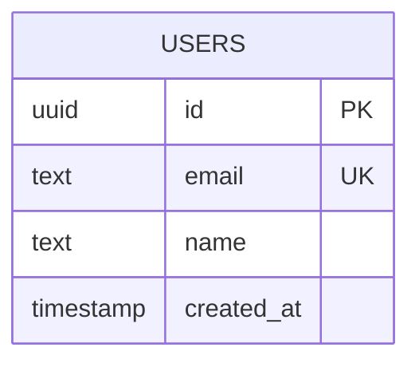

_This project has been created as part of the 42 curriculum by mde-krui, diwalaku, dkolodze, ccraciun and rtorrent._

# ft_transcendence

## 1. Description

Full-stack event management platform where users can create, manage and participate in events. Organizers can set up events with details and users can browse, register and track upcoming events.

---

## 2. Team Information

The operational roles and specific core responsibilities assigned across our team are detailed below:

- **Product Owner (PO):** `diwalaku`
  - _Responsibilities:_ Defines the overarching product vision, owns and prioritizes the feature backlogs, sets acceptance criteria, and validates completed iteration deliverables.
- **Project Manager (PM) / Scrum Master:** `dkolodze`
  - _Responsibilities:_ Coordinates agile ceremonies, eliminates project blockers, monitors phase milestones, updates sprint timelines, and safeguards overall team synchronization.
- **Technical Lead / Architect:** `mde-krui`
  - _Responsibilities:_ Evaluates technical stack options, enforces code-quality standards, reviews pull requests, and orchestrates architectural schemas across frontend, backend, and data tiers.
- **Developers (All Members):**
  - `mde-krui`: Core focus on `Frontend and backend architecture.`.
  - `dkolodze`: Core focus on `[INSERT e.g., WebSockets implementation, UI components, etc.]`.
  - `rtorrent`: Core focus on `[INSERT e.g., DevOps pipeline, Database migration, etc.]`.
  - `diwalaku`: Core focus on `[INSERT e.g., Game rendering, State-management, etc.]`.
  - `ccraciun`: Core focus on `[INSERT e.g., OAuth integration, Security audits, etc.]`.

---

## 3. Project Management

### Task Management & Tracking

We structured our development roadmap into iterative sprints.

- **Project Management Tool:** [GitHub Projects](https://github.com/users/milandekruijf/projects/3) is used to move components from Backlog $\rightarrow$ In Progress $\rightarrow$ Code Review $\rightarrow$ Done.
- **Meeting Cadence:** We conducted [INSERT e.g., daily standups / bi-weekly syncs] to review progress, coordinate integrations, and redistribute blockers.

### Team Communication Channels

- **Primary Communications:** A simple Slack channel group.
- **Asynchronous Coordination:** Critical technical blockers, deployment updates, and environment updates were broadcasted via [INSERT e.g., #dev-announcements channel / Git PR comments].

---

## 4. Technical Stack

Our monorepo architecture (managed by [Vite+](https://viteplus.dev/) and [Bun](https://bun.sh/)) consists of the following components:

- **Frontend Framework:** [React](https://react.dev/) with [TanStack Start](https://tanstack.com/start) and [TanStack Router](https://tanstack.com/router).
  - _Justification:_ TanStack Start gives us file-based routing and SSR on top of React, paired with [TanStack Query](https://tanstack.com/query) for server-state/cache management and [TanStack Form](https://tanstack.com/form) for client-side form validation shared against the same Zod schemas the backend validates with.
- **Backend Framework:** [NestJS](https://nestjs.com/) with [tRPC](https://nestjs-trpc.io/) (via `nestjs-trpc`).
  - _Justification:_ NestJS's modular, dependency-injected structure suits a growing feature set, and tRPC gives us end-to-end typed API calls (including subscriptions for real-time updates) without hand-written REST client code.
- **Database Engine:** [PostgreSQL](https://www.postgresql.org/) via [Drizzle ORM](https://orm.drizzle.team/), with [Redis](https://redis.io/) for backend cache and rate-limit storage.
  - _Justification:_ PostgreSQL fits our relational data (events, registrations, users). Drizzle keeps table definitions, migrations, and Zod validation schemas (via `drizzle-zod`) derived from one shared source in `packages/schemas`.
- **Styling Engine:** [Tailwind CSS](https://tailwindcss.com/).
  - _Justification:_ Utility-first styling paired with a shared `shadcn`-based component library gives us consistent, responsive UI without a separate design-system build step.

See [Stack](./docs/STACK.md) for the full technology list and architecture principles.

---

## 5. Database Schema

Current schema (implemented so far — additional tables for events, registrations, and friends are planned but not yet implemented):



See [Database](./docs/DATABASE.md) for the migration workflow and how this schema is kept in sync with API validation.

---

## 6. Features List

An inventory of all technical systems and interface modules deployed across the platform, cross-referenced with their primary authors.

_Status: only a demo Users CRUD flow exists in the codebase today (see [API](./docs/API.md)). This table will be filled in as event management, authentication, and the other selected modules from [section 7](#7-modules-matrix) are implemented._

| Feature Area                       | Functional Scope                                                                       | Primary Author   |
| ---------------------------------- | -------------------------------------------------------------------------------------- | ---------------- |
| **Authentication & Core Security** | Signup, login, password hashing/salting, and HTTPS middleware routing.                 | `[INSERT Login]` |
| **Legal Baselines**                | Fully functional and production-mapped Privacy Policy and Terms of Service interfaces. | `[INSERT Login]` |
| **[INSERT Module Category]**       | [INSERT Description of specific operational logic implemented.]                        | `[INSERT Login]` |
| **[INSERT Module Category]**       | [INSERT Description of specific operational logic implemented.]                        | `[INSERT Login]` |
| **[INSERT Module Category]**       | [INSERT Description of specific operational logic implemented.]                        | `[INSERT Login]` |

---

## 7. Modules Matrix

Our team selected the following combination of Major (2 pts) and Minor (1 pt) modules, confirmed for a total of 15 points against the mandatory 14-point threshold. **None of these are implemented yet** — the codebase currently contains only a demo Users CRUD flow (see [section 5](#5-database-schema) and [section 6](#6-features-list)); status will be updated as each module lands. Assigned developers and points are tracked per-task on the [GitHub Project board](https://github.com/users/milandekruijf/projects/3).

| Module Selected                                                 | Type  | Points | Status              |
| --------------------------------------------------------------- | ----- | ------ | ------------------- |
| Full Framework (NestJS backend + React/TanStack Start frontend) | Major | 2      | Not yet implemented |
| Database integration via an ORM (Drizzle ORM)                   | Minor | 1      | Not yet implemented |
| Complete Notification System across all CRUD operations         | Minor | 1      | Not yet implemented |
| Advanced search functionality (filters, sorting, pagination)    | Minor | 1      | Not yet implemented |
| Multi-language support (3 languages)                            | Minor | 1      | Not yet implemented |
| Extended multi-browser support                                  | Minor | 1      | Not yet implemented |
| Full WCAG 2.1 AA accessibility compliance                       | Major | 2      | Not yet implemented |
| Standard user management and authentication                     | Major | 2      | Not yet implemented |
| Remote authentication via OAuth 2.0                             | Minor | 1      | Not yet implemented |
| Secure Two-Factor Authentication (2FA)                          | Minor | 1      | Not yet implemented |
| Advanced CRUD permissions and Role Management                   | Major | 2      | Not yet implemented |
| **TOTAL SELECTED POINTS**                                       |       | **15** |                     |

### Candidate bonus modules (not yet committed to)

These were identified as possible additions if time allows, worth up to 6 more points:

| Module Candidate                                        | Type  | Points |
| ------------------------------------------------------- | ----- | ------ |
| Custom-made design system (min. 10 reusable components) | Minor | 1      |
| Right-to-left (RTL) language support                    | Minor | 1      |
| Machine learning recommendation system                  | Major | 2      |
| Sentiment analysis on user-generated content            | Minor | 1      |
| AI content moderation                                   | Minor | 1      |

---

## 8. Individual Contributions

Detailed logs outlining development efforts, challenges, and solutions for each developer:

### Developer 1: `[INSERT Login]`

- **Key System Additions:** [INSERT List individual features implemented.]
- **Technical Roadblocks:** [INSERT Detail complex code challenges, network loops, or performance bottlenecks discovered during design phases.]
- **Resolution Strategy:** [INSERT Explain how you resolved the blocker, redesigned elements, or adjusted logic to meet validation constraints.]

### Developer 2: `[INSERT Login]`

- **Key System Additions:** [INSERT List individual features implemented.]
- **Technical Roadblocks:** [INSERT Detail complex code challenges, network loops, or performance bottlenecks discovered during design phases.]
- **Resolution Strategy:** [INSERT Explain how you resolved the blocker, redesigned elements, or adjusted logic to meet validation constraints.]

### Developer 3: `[INSERT Login]`

- **Key System Additions:** [INSERT List individual features implemented.]
- **Technical Roadblocks:** [INSERT Detail complex code challenges, network loops, or performance bottlenecks discovered during design phases.]
- **Resolution Strategy:** [INSERT Explain how you resolved the blocker, redesigned elements, or adjusted logic to meet validation constraints.]

### Developer 4: `[INSERT Login]`

- **Key System Additions:** [INSERT List individual features implemented.]
- **Technical Roadblocks:** [INSERT Detail complex code challenges, network loops, or performance bottlenecks discovered during design phases.]
- **Resolution Strategy:** [INSERT Explain how you resolved the blocker, redesigned elements, or adjusted logic to meet validation constraints.]

### Developer 5: `[INSERT Login]`

- **Key System Additions:** [INSERT List individual features implemented.]
- **Technical Roadblocks:** [INSERT Detail complex code challenges, network loops, or performance bottlenecks discovered during design phases.]
- **Resolution Strategy:** [INSERT Explain how you resolved the blocker, redesigned elements, or adjusted logic to meet validation constraints.]

---

## 9. Instructions

Follow these steps to configure, build, and deploy the application environment locally.

### Prerequisites

- [Nix](https://nixos.org/download/) (recommended — see [Dev Environment](./docs/DEVENVIRONMENT.md)) or the [Vite+](https://viteplus.dev/) installer.
- [Docker Engine](https://docs.docker.com/) $\ge$ v20.10 or Podman equivalent, with Docker Compose v2.

Full setup steps: [Development](./docs/DEVELOPMENT.md).

### Environment Setup (`.env`)

Local development already works out of the box using the committed defaults in `apps/backend/.env.development` (see [Environment](./docs/ENVIRONMENT.md) for the full variable list — `DATABASE_URL`, `PORT`, `REDIS_URL`, cache/throttle tuning). For local overrides or production secrets, create an ignored `.env` file at the repo root or in `apps/backend`.

> **Known gap:** the 42 subject requires a committed `.env.example` file; this repository does not have one yet. Adding it is tracked as a task on the [project board](https://github.com/users/milandekruijf/projects/3).

### Single-Command Application Launch

Build and start the frontend, backend, PostgreSQL, and Redis services with one command:

```bash
vp run deploy
```

This runs the Vite+ `repo:deploy` task, which executes `docker compose up --build`.
For detached local deployment, use `vp run deploy:detached`.

Once the stack has started, open the application at `https://localhost:3000`.

Caddy terminates TLS with the certificate in `caddy/certs` and is the only service
published on the host: it forwards `/api/*` to the backend and everything else to the
frontend, so the browser never talks plain HTTP. The frontend and backend containers are
reachable only inside the Compose network (`http://frontend:3000`, `http://backend:3001`).
Plain `http://localhost` redirects to HTTPS.

Caddy listens on `3000` (HTTPS) and `3080` (redirect to HTTPS) rather than `443`/`80`
because rootless Docker (Codam machines) can't bind ports below 1024. `HTTPS_PORT`,
`HTTP_PORT` and `PUBLIC_ORIGIN` in the root `.env` change this — see
[Environment](./docs/ENVIRONMENT.md#compose-variables).

The committed certificate is a local [mkcert](https://github.com/FiloSottile/mkcert) one,
so a browser that hasn't trusted its mkcert root shows a one-time warning you can click
through. To get a trusted certificate on your own machine instead, run this from the Nix
dev shell (it works without sudo — browser trust stores only — which is what Codam
machines need), then restart your browser and `docker compose restart caddy`:

```bash
bash scripts/generate-certs.sh
```

---

## 10. Resources & AI Disclosure

### Reference Materials

- [INSERT Link/Doc title: e.g., MDN WebSockets Protocol Specifications]
- [INSERT Link/Doc title: e.g., Tailwind Layout Grid System guides]

### Artificial Intelligence (AI) Usage Disclosure

In strict accordance with the 42 validation rules and this repository's [AGENTS.md](./AGENTS.md) policy, AI assistance here is restricted to documentation maintenance and project-management tasks — never application code, tests, configuration, or secrets.

1. **Where/How AI was Used:** Claude Code was used to (a) audit `docs/**` and this README against the actual source code and fix inaccuracies (stale commands, missing cross-links, unfilled sections that could be answered from real code/config), and (b) break the product spec down into a task backlog on the [GitHub Project board](https://github.com/users/milandekruijf/projects/3) with estimates and a rough roadmap.
2. **Validation Process:** All documentation edits were reviewed by the team before merging. No application code, tests, or configuration were written or modified by AI. [INSERT: add further entries here as AI assists with additional repetitive/documentation tasks.]
