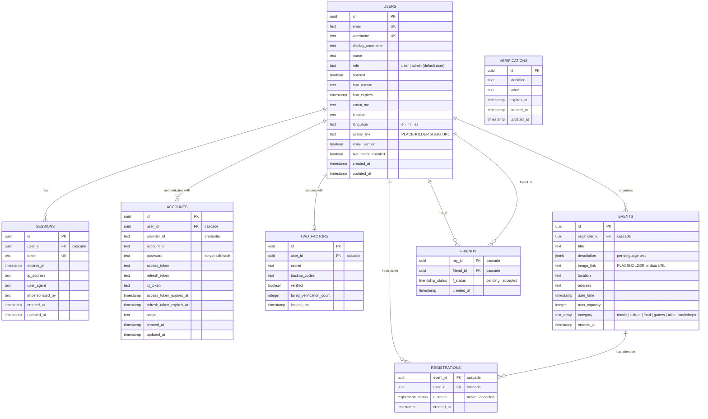

_This project has been created as part of the 42 curriculum by mde-krui, diwalaku, dkolodze, ccraciun, rtorrent._

# ft_transcendence — Eventra

## 1. Description

**Eventra** is a multi-user event platform. Visitors browse, filter, sort and page through
upcoming events. Registered users get tickets for events with limited capacity, create and
manage their own events, keep a profile with an avatar, add friends and see who is online,
and talk in a live chat. Administrators manage every user and event from a dashboard.
Every change — a new event, a sold-out ticket, a friend coming online, a chat message — is
pushed live to all open browsers.

Key functionalities:

- Public event catalogue with category filters, three sort orders and server-side pagination.
- Accounts with e-mail + password sign-up, password reset, optional two-factor authentication.
- Ticket registration with a capacity guarantee (one active ticket per user per event, no overbooking).
- Event creation and editing for organisers; "My events" and "My tickets" pages.
- Profiles with avatar upload, about/location fields and a preferred language.
- Friends with requests/acceptance and live online/offline status; global chat.
- Notifications on every create/update/delete: toasts in the app, transactional e-mails
  (welcome, ticket confirmation, event modified, event cancelled) in the user's language.
- Admin dashboard: user table with role management, event table over all events.
- Interface in English, Dutch and Spanish, switchable in-app and remembered per user.
- Server-side rendering, HTTPS everywhere, single-command Docker deployment.

---

## 2. Team Information

- **Product Owner (PO):** `diwalaku`
  - _Responsibilities:_ product vision, backlog priorities, acceptance criteria, validation of finished work.
- **Project Manager (PM) / Scrum Master:** `dkolodze`
  - _Responsibilities:_ coordination, blockers, milestones and timelines, team synchronisation.
- **Technical Lead / Architect:** `mde-krui`
  - _Responsibilities:_ stack decisions, code-quality standards, pull-request reviews, overall architecture across frontend, backend and data.
- **Developers (all members):**
  - `mde-krui`: monorepo and tooling, NestJS + tRPC backend architecture, authentication wiring, admin dashboard, profile persistence, Spanish locale.
  - `diwalaku`: landing page and navigation, event catalogue (filters, sorting, pagination), event cards and detail page, ticket registration logic, accessibility fixes, Dutch locale, legal pages.
  - `dkolodze`: two-factor authentication, early authentication work, project management and documentation.
  - `ccraciun`: real-time layer (events, presence, chat), friends, avatar upload, HTTPS/Caddy and Docker deployment, browser-compatibility test suite, responsive layout.
  - `rtorrent`: notification system (toasts, mailer, multilingual e-mail templates), "My tickets" page.

---

## 3. Project Management

### Task management & tracking

- **Board:** [GitHub Projects](https://github.com/users/milandekruijf/projects/3) — Backlog → In Progress → Code Review → Done. The product spec was broken down into tasks with estimates on this board.
- **Branches and reviews:** every feature lives on its own branch and reaches `main` through a pull request reviewed by the tech lead (e.g. #53 event timezone, #64 e-mail notifications, #65 chat, #66 landing page, #68 profile persistence).
- **Continuous integration:** [`.github/workflows/ci.yml`](./.github/workflows/ci.yml) runs formatting, linting, type checks, unit tests and the production build on every pull request and push to `main`. A pre-commit hook runs the same checks on staged files.
- **Documentation as source of truth:** the [`docs/`](./docs/README.md) folder (stack, database, API, authentication, environment, i18n, browser support…) is kept in sync with the code; [`AGENTS.md`](./AGENTS.md) points contributors and tools to it.

### Team communication

- **Primary channel:** the team's Slack group. Coordination was mostly asynchronous — blockers, deployment and environment changes were announced there, and members paired ad hoc when integrating features.
- **Technical discussion** happened on pull requests and directly on the board cards.

---

## 4. Technical Stack

The monorepo is managed with [Vite+](https://viteplus.dev/) and [Bun](https://bun.sh/) (workspaces `apps/frontend`, `apps/backend`, `packages/schemas`, `packages/tsconfig`).

- **Frontend:** [React 19](https://react.dev/) with [TanStack Start](https://tanstack.com/start) and [TanStack Router](https://tanstack.com/router).
  - _Why:_ file-based routing and server-side rendering on plain React and Vite, type-safe search parameters (used for the catalogue's filters and pagination URLs), and native integration with [TanStack Query](https://tanstack.com/query) for server state and [TanStack Form](https://tanstack.com/form) for forms.
- **Backend:** [NestJS 11](https://nestjs.com/) with [tRPC](https://trpc.io/) via [`nestjs-trpc`](https://nestjs-trpc.io/).
  - _Why:_ NestJS modules and dependency injection keep nine feature modules (auth, users, events, listings, registrations, friends, presence, chat, notifications) in the same router → service → repository shape and unit-testable with in-memory repositories. tRPC gives the frontend the backend's types directly: a renamed field fails the type check instead of failing at runtime, and the same Zod schemas validate on both sides. tRPC subscriptions (Server-Sent Events) carry the real-time updates over the existing HTTPS connection.
- **Authentication:** [better-auth](https://www.better-auth.com/) on our own PostgreSQL tables through its Drizzle adapter.
  - _Why:_ sessions, scrypt password hashing with per-user salts, rate limiting, the username, admin and two-factor plugins — instead of writing security-critical code ourselves.
- **Database:** [PostgreSQL 17](https://www.postgresql.org/) through [Drizzle ORM](https://orm.drizzle.team/), plus [Redis 8](https://redis.io/) for the backend cache and rate-limit counters.
  - _Why:_ relational data with real constraints (foreign keys with cascades, enums, a partial unique index that guarantees one active ticket per user per event). Drizzle keeps table definitions, generated SQL migrations and Zod validation (`drizzle-zod`) derived from one TypeScript source in `packages/schemas`.
- **Styling:** [Tailwind CSS 4](https://tailwindcss.com/) with a [shadcn/ui](https://ui.shadcn.com/)-based component library owned in the repository.
  - _Why:_ utility classes on top of our own design tokens (`apps/frontend/src/styles.css`), responsive breakpoints, dark mode, and accessible primitives (dialogs, sheets, comboboxes, calendars) without a separate design-system build.
- **Internationalisation:** [Paraglide JS](https://inlang.com/m/gerre34r/library-inlang-paraglideJs) — compiled, type-safe message functions for `en`, `nl`, `es`.
- **Delivery:** Docker Compose with a [Caddy](https://caddyserver.com/) TLS reverse proxy; [Mailpit](https://mailpit.axllent.org/) catches outgoing e-mail locally.
- **Quality:** [Vitest](https://vitest.dev/) unit tests (backend services, routers, repositories, health indicators), [Playwright](https://playwright.dev/) end-to-end and console-cleanliness tests on Chromium and Firefox, Prettier + linting + `tsc` in CI.

See [Stack](./docs/STACK.md) for the full list and the architecture principles.

---

## 5. Database Schema

Eight tables, defined once in [`packages/schemas/src/database.ts`](./packages/schemas/src/database.ts); the SQL migrations in `apps/backend/drizzle` are generated from it.



Design notes:

- **Cascades:** deleting a user removes their sessions, accounts, 2FA secret, owned events, friendships and tickets; deleting an event removes its registrations.
- **One active ticket per user per event:** `registrations` has a partial unique index on `(event_id, user_id) WHERE r_status = 'active'`. A user can cancel and register again (history is kept), but never hold two active tickets; registration runs in a transaction that checks capacity, so concurrent requests cannot overbook.
- **Enums** `registration_status` and `friendship_status` are PostgreSQL enum types.
- **Authentication tables** (`sessions`, `accounts`, `verifications`, `two_factors`) follow better-auth's model; passwords live only in `accounts.password` as `salt:hash`, never in `users`.
- **Images** are stored as client-compressed data URLs (≤ 48 kB avatars, ≤ 72 kB event pictures) — no separate file storage to run; the trade-off is row size.

See [Database](./docs/DATABASE.md) for the migration workflow.

---

## 6. Features List

| Feature area                    | Functional scope                                                                                                                            | Primary author(s)                   |
| ------------------------------- | ------------------------------------------------------------------------------------------------------------------------------------------- | ----------------------------------- |
| **Monorepo & tooling**          | Vite+/Bun workspaces, shared `packages/schemas` (tables, Zod schemas, generated tRPC types), task graph, CI, pre-commit hooks               | `mde-krui`                          |
| **Backend architecture**        | NestJS modules with router → service → repository layers, in-memory repositories for tests, Redis cache and rate limiting, health checks    | `mde-krui`                          |
| **Authentication**              | E-mail + password sign-up/login (better-auth, scrypt), sessions, forgot/reset password                                                      | `mde-krui`, `dkolodze`, `diwalaku`  |
| **Two-factor authentication**   | TOTP enrolment with QR code, backup codes, `/verify-2fa` step, lockout counter                                                              | `dkolodze` (later fixes `mde-krui`) |
| **Event catalogue**             | Server-side category filter, three sort orders, pagination, URL-synced state, featured events, statistics                                   | `diwalaku`                          |
| **Event creation & management** | Create/edit/delete with date picker, category combobox, image picker with client-side compression; "My events" page                         | `diwalaku`, `mde-krui`, `ccraciun`  |
| **Ticket registration**         | Register/cancel, availability, attendee lists, transactional capacity check                                                                 | `diwalaku`                          |
| **My tickets**                  | Registered events overview with search and cancellation                                                                                     | `rtorrent`                          |
| **Real-time updates**           | tRPC SSE subscriptions with heartbeat and reconnect watchdog: live event list, live user stream for the admin dashboard                     | `ccraciun`                          |
| **Presence & friends**          | Online/offline tracking, friend requests/acceptance/removal, user search                                                                    | `ccraciun`                          |
| **Chat**                        | Global live chat room (SSE broadcast)                                                                                                       | `ccraciun`                          |
| **Profile & avatar**            | Profile page, editable fields, preferred language, avatar upload with initials fallback                                                     | `mde-krui`, `ccraciun`              |
| **Notifications**               | Toasts on every create/update/delete; welcome, ticket, event-modified and event-cancelled e-mails in five languages via Mailpit             | `rtorrent` (toasts `mde-krui`)      |
| **Admin dashboard**             | Users table with role management, all-events table, search                                                                                  | `mde-krui`                          |
| **Internationalisation**        | Paraglide with English, Dutch, Spanish; in-app switcher; per-user preference                                                                | `diwalaku`, `mde-krui`              |
| **Landing page & navigation**   | Hero, how-it-works, categories, FAQ, footer, role-aware navbar with mobile drawer                                                           | `mde-krui`, `diwalaku`, `ccraciun`  |
| **Legal pages**                 | Privacy Policy and Terms of Service in three languages, linked from the footer and the sign-up form                                         | `mde-krui`, `diwalaku`              |
| **Database**                    | Drizzle schema, migrations, seed script with demo accounts and events                                                                       | `diwalaku`, `mde-krui`              |
| **Deployment & HTTPS**          | Docker Compose stack, Caddy TLS proxy, migrations and seeding on start-up, environment handling                                             | `mde-krui`, `ccraciun`              |
| **Browser compatibility & e2e** | Playwright suites on Chromium and Firefox, console-cleanliness checks on every route, [browser support document](./docs/BROWSER_SUPPORT.md) | `ccraciun`                          |
| **Responsive layout**           | Phone/tablet layout: navbar drawer, stacked catalogue, card layout, chat widget                                                             | `ccraciun`                          |
| **Documentation**               | `docs/` set, README, onboarding                                                                                                             | `mde-krui`, `ccraciun`, `dkolodze`  |

---

## 7. Modules Matrix

Selected modules (Major = 2 pts, Minor = 1 pt), total **15 points** against the 14-point minimum.

| Module (subject wording)                                                             | Type  | Pts    | Implementation                                                                                                                                                                                                                                                               | Developer(s)           |
| ------------------------------------------------------------------------------------ | ----- | ------ | ---------------------------------------------------------------------------------------------------------------------------------------------------------------------------------------------------------------------------------------------------------------------------- | ---------------------- |
| Full framework: backend framework + frontend framework                               | Major | 2      | NestJS 11 backend (`apps/backend`), React 19 + TanStack Start frontend (`apps/frontend`), joined by typed tRPC procedures                                                                                                                                                    | `mde-krui`             |
| Real-time features (WebSockets or similar)                                           | Major | 2      | tRPC subscriptions over Server-Sent Events: live event list (`events.onEventChanged` with heartbeat and stale-connection watchdog), presence (`presence.onPresenceChanged`), chat (`chat.onMessage`), admin user stream; graceful disconnects via `AbortSignal`              | `ccraciun`             |
| Standard user profiles (avatar upload, profile page, online/offline friend tracking) | Major | 2      | `/profile` with editable fields and compressed avatar upload, friends list with live status dots, friend requests                                                                                                                                                            | `mde-krui`, `ccraciun` |
| Advanced CRUD permissions and role management                                        | Major | 2      | Three roles with distinct rights — visitor (browse only), user (own events, tickets, profile), admin (all users and events, role changes) — enforced server-side by `ProtectedMiddleware`, `AdminMiddleware` and ownership checks; role-aware navigation and admin dashboard | `mde-krui`             |
| Database integration via an ORM                                                      | Minor | 1      | Drizzle ORM: schema in TypeScript, generated migrations, typed repositories, `drizzle-zod` validation                                                                                                                                                                        | `diwalaku`, `mde-krui` |
| Secure two-factor authentication                                                     | Minor | 1      | better-auth TOTP plugin: QR enrolment, backup codes, verification step at login, failed-attempt lockout                                                                                                                                                                      | `dkolodze`             |
| Multi-language support (≥ 3 complete translations, in-app toggle)                    | Minor | 1      | English, Dutch, Spanish — every UI string (374 keys per locale) and the legal pages; switcher in the navbar; stored per user; e-mails localised too                                                                                                                          | `diwalaku`, `mde-krui` |
| Server-side rendering                                                                | Minor | 1      | TanStack Start + Nitro: route loaders run on the server, pages arrive rendered with data                                                                                                                                                                                     | `mde-krui`             |
| Extended multi-browser support                                                       | Minor | 1      | Chrome, Firefox and Edge; Playwright suites on Chromium and Firefox; findings and limitations documented in [Browser Support](./docs/BROWSER_SUPPORT.md)                                                                                                                     | `ccraciun`             |
| Complete notification system across all CRUD operations                              | Minor | 1      | Toast for every create/update/delete (global mutation cache), e-mails to affected users (welcome, ticket confirmation, event modified, event cancelled), live updates to everyone                                                                                            | `rtorrent`, `mde-krui` |
| Advanced search with filtering, sorting and pagination                               | Minor | 1      | Catalogue query executed in the backend (`events.getFilteredEvents`): multi-category filter, upcoming/popular/newest sort, page size 8, URL-synced; text search in the admin dashboard and "My tickets"                                                                      | `diwalaku`             |
| **Total**                                                                            |       | **15** |                                                                                                                                                                                                                                                                              |                        |

---

## 8. Individual Contributions

### `mde-krui` — Technical Lead

- **Key additions:** monorepo setup (Vite+, Bun workspaces, shared schemas package, task graph, CI), NestJS + tRPC backend architecture with repository abstraction, better-auth integration, admin dashboard, profile persistence, global mutation toasts, Spanish locale, landing-page work, most of the `docs/` set.
- **Roadblock:** the admin dashboard hung on "Saving changes…" — it opened three separate SSE streams (user created/updated/deleted) next to the event, presence and chat streams, which exhausted the browser's per-origin connection limit so mutations never got a slot.
- **Resolution:** merged the three streams into one `userChanged` subscription carrying an action discriminator (see the comment in `packages/schemas/src/users.ts`), mirroring the event stream design; also moved route loaders to `query` with `staleTime: 'static'` so a backend restart no longer breaks page loads.

### `diwalaku` — Product Owner

- **Key additions:** landing page and navigation, event catalogue with server-side filtering/sorting/pagination, event cards and detail page, ticket registration flow, Dutch translations, accessibility fixes (contrast, focus styles), privacy and terms content.
- **Roadblock:** two users registering for the last ticket at the same time could both succeed, and the catalogue filtered and paged in the browser over the full event list.
- **Resolution:** moved registration into a transaction with a capacity check and explicit result types mapped to tRPC errors (`conflictError` for sold out / already registered), backed by a partial unique index; moved filtering, sorting and pagination into the repository query.

### `dkolodze` — Project Manager

- **Key additions:** two-factor authentication (TOTP enrolment with QR code, backup codes, `/verify-2fa` route, lockout fields), early authentication and environment work, documentation updates; owner of the board, timelines and blockers.
- **Roadblock:** better-auth's 2FA flow interrupts the normal sign-in: after a correct password the session is not yet valid until the code is verified, which the existing login form and route guards did not expect.
- **Resolution:** an explicit `/verify-2fa` step in the login flow and a settings component on the profile page to enrol and disable 2FA, with the schema fields (`two_factors`, `users.two_factor_enabled`) added through a generated migration.

### `ccraciun` — Developer

- **Key additions:** real-time layer (event stream with heartbeat and watchdog, presence, chat), friends, avatar upload with client-side compression, Caddy/HTTPS routing and the Docker deployment, Playwright console-cleanliness and cross-browser suites, responsive layout, browser-support documentation.
- **Roadblocks:** (1) events came back two hours off between Docker (UTC) and a laptop (Amsterdam) because writes parsed the wall clock as local time while reads formatted it in UTC; (2) the first HTTPS setup still had the browser calling the backend on plain `http://localhost:3001`, which Chrome blocks as mixed content; (3) Firefox aborts in-flight requests on navigation and logged them as errors.
- **Resolution:** (1) one encode/decode pair for the naive `timestamp` column (`toEventDateTime` / `fromEventDateTime`) with a unit test; (2) Caddy as the only published service, `/api/*` proxied on the same origin so the browser uses relative URLs; (3) caught-error filtering after `beforeunload`, documented as BS-11.

### `rtorrent` — Developer

- **Key additions:** notification system — toasts, the mailer module, react-email templates for welcome, ticket confirmation, event modification and event cancellation in five languages, event-listener wiring on the app-events bus — and the "My tickets" page with search and cancellation.
- **Roadblock:** the mailer and react-email dependencies did not load in the Bun workspace at first, and the welcome e-mail was sent before the user row existed.
- **Resolution:** pinned the mailer dependencies in the lockfile, moved e-mail sending to listeners on domain events emitted after the database write (`userCreated`, `registrationCreated`, `eventModified`, `eventCancelled`), with Mailpit in the Compose stack to verify delivery.

---

## 9. Instructions

### Prerequisites

- [Docker Engine](https://docs.docker.com/) ≥ 20.10 (or Podman) with Docker Compose v2 — this is all that is needed to run the application.
- For development only: the [Vite+](https://viteplus.dev/) installer (provides Bun and the `vp` command). See [Prerequisites](./docs/PREREQUISITES.md) and [Development](./docs/DEVELOPMENT.md).

### Environment (`.env`)

Nothing has to be configured to run locally: `docker-compose.yml` and `apps/backend/.env.development` carry labelled localhost defaults. [`.env.example`](./.env.example) lists every variable; copy it to an ignored `.env` at the repository root to override ports, origin, database credentials, the auth secret or the demo passwords (see [Environment](./docs/ENVIRONMENT.md)). No secret is committed: `.env` is git-ignored and the auth secret in the defaults is an explicit placeholder.

### Single-command application launch

Build and start the whole stack — Caddy, frontend, backend, PostgreSQL, Redis, Mailpit —
with one command from a fresh clone:

```bash
docker compose up --build
```

(`vp run deploy` is an alias for the same command; `vp run deploy:detached` adds `-d`.)

Nothing else is needed: the backend applies the database migrations from
`apps/backend/drizzle` when it starts, and the one-shot `seed` service then creates the
demo accounts and events (it skips anything that already exists, so reruns are safe).

Once the stack has started, open the application at `https://localhost:3000`.
E-mails sent by the app land in Mailpit at `http://localhost:8025`.

Demo accounts (passwords are the `SEED_*` values, see [Environment](./docs/ENVIRONMENT.md)):

| Account       | E-mail                      | Default password    |
| ------------- | --------------------------- | ------------------- |
| Administrator | `admin@transcendence.local` | `Transcendence123!` |
| User          | `didi@example.com`          | `Qwerty123!`        |
| User          | `homer@example.com`         | `Simpsons123!`      |

Caddy terminates TLS and is the only service published on the host: it forwards `/api/*`
to the backend and everything else to the frontend, so the browser never talks plain HTTP.
The frontend and backend containers are reachable only inside the Compose network
(`http://frontend:3000`, `http://backend:3001`). Plain `http://localhost` redirects to HTTPS.

Caddy listens on `3000` (HTTPS) and `3080` (redirect to HTTPS) rather than `443`/`80`
because rootless Docker (Codam machines) can't bind ports below 1024. `HTTPS_PORT`,
`HTTP_PORT` and `PUBLIC_ORIGIN` in the root `.env` change this — see
[Environment](./docs/ENVIRONMENT.md#compose-variables).

No certificate is committed. On a fresh clone Caddy issues its own self-signed
certificate (`tls internal`), so the browser shows a one-time warning you can click
through. To get a trusted certificate on your own machine instead, install
[mkcert](https://github.com/FiloSottile/mkcert) (plus `certutil` from `libnss3-tools` on
Linux, which mkcert needs to write the Chrome and Firefox trust stores), run the script
below (it works without sudo — browser trust stores only — which is what Codam machines
need), then restart your browser and `docker compose restart caddy`. The script writes
the certificate into the git-ignored `caddy/certs/`; Caddy uses it whenever it is there:

```bash
bash scripts/generate-certs.sh
```

### Development and tests

```bash
vp run dev            # PostgreSQL + Redis in Docker, backend and frontend with hot reload
vp run check          # formatting, linting, type checks (what CI runs)
vp run test           # Vitest unit tests (backend + frontend)
vp run test:e2e       # Playwright suites against the running stack (Chromium + Firefox)
```

Full command list: [Tooling](./docs/TOOLING.md).

---

## 10. Resources & AI Disclosure

### Reference materials

- [TanStack Start, Router, Query and Form documentation](https://tanstack.com/)
- [NestJS documentation](https://docs.nestjs.com/) and [nestjs-trpc](https://nestjs-trpc.io/)
- [tRPC documentation](https://trpc.io/docs) — subscriptions over SSE, error formatting
- [better-auth documentation](https://www.better-auth.com/docs) — e-mail/password, two-factor, admin and username plugins
- [Drizzle ORM documentation](https://orm.drizzle.team/docs/overview) and [drizzle-zod](https://orm.drizzle.team/docs/zod)
- [Zod documentation](https://zod.dev/)
- [Tailwind CSS](https://tailwindcss.com/docs) and [shadcn/ui](https://ui.shadcn.com/docs)
- [Paraglide JS (inlang)](https://inlang.com/m/gerre34r/library-inlang-paraglideJs)
- [Caddy reverse proxy and TLS](https://caddyserver.com/docs/)
- [Docker Compose](https://docs.docker.com/compose/), [Playwright](https://playwright.dev/docs/intro), [Vitest](https://vitest.dev/guide/)
- [react-email](https://react.email/docs) and [Mailpit](https://mailpit.axllent.org/docs/)
- MDN: [Server-Sent Events](https://developer.mozilla.org/en-US/docs/Web/API/Server-sent_events), [mixed content](https://developer.mozilla.org/en-US/docs/Web/Security/Mixed_content)

### Artificial Intelligence (AI) usage disclosure

AI assistance (Claude Code) was used for repetitive and review tasks, in line with the 42 rules; every piece of AI-assisted output was read, tested and is explainable by the team member who merged it.

1. **Documentation and project management:** auditing `docs/**` and this README against the source code and fixing inaccuracies; breaking the product spec down into a task backlog on the project board.
2. **Pre-evaluation audit and the fixes derived from it (September 2026):** a review of the codebase against the evaluation criteria, followed by targeted changes that were reviewed and verified by the team on a fresh clone — running database migrations and the seed at container start-up, letting Caddy issue a certificate when none is present so no key is committed, stricter server-side validation of event input (date/time format, size limits, image format), a 404 instead of an error page for unknown event ids, a generic message for unexpected server errors, and removal of leftover debug code. Unit tests, the type checker and the browser suites cover these changes.
3. **What AI was not used for:** the product features themselves (events, tickets, real-time, friends, chat, notifications, 2FA, i18n, admin) were designed and written by the team members listed in sections 6 and 8.
