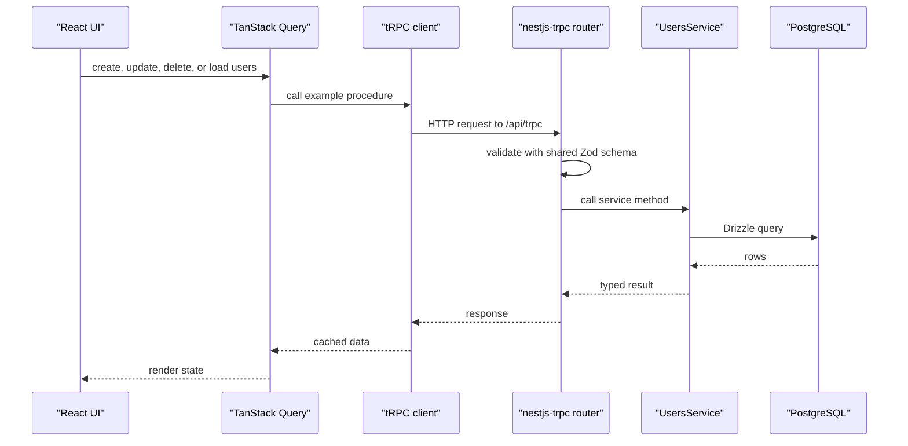

# API

The backend exposes a tRPC API through `nestjs-trpc`.

## Base Path

```text
http://localhost:3001/api/trpc
```

The tRPC router implementation currently lives in:

```text
apps/backend/src/trpc.router.ts
```

Generated client router types live in:

```text
packages/schemas/src/@generated/server.ts
```

Regenerate them with:

```bash
vp run trpc:generate
```

## Current Router

The current router alias is:

```text
example
```

| Procedure               | Type         | Input              | Output                  | Notes                                                    |
| ----------------------- | ------------ | ------------------ | ----------------------- | -------------------------------------------------------- |
| `example.getTodos`      | Query        | None               | Array of `{ id, name }` | Temporary example data.                                  |
| `example.getUsers`      | Query        | None               | Array of users          | Reads users from PostgreSQL through Drizzle.             |
| `example.createUser`    | Mutation     | `createUserSchema` | User                    | Creates a user and rejects duplicate email addresses.    |
| `example.updateUser`    | Mutation     | `updateUserSchema` | User                    | Updates a user and rejects missing or duplicate records. |
| `example.deleteUser`    | Mutation     | `deleteUserSchema` | User                    | Deletes a user and rejects missing records.              |
| `example.onUserCreated` | Subscription | None               | User stream             | Streams newly created users to subscribed clients.       |
| `example.onUserUpdated` | Subscription | None               | User stream             | Streams updated users to subscribed clients.             |
| `example.onUserDeleted` | Subscription | None               | User stream             | Streams deleted users to subscribed clients.             |

## Shared Contracts

User input/output contracts are imported from:

```text
@repo/schemas/users
```

The frontend calls these procedures through TanStack Query and `@trpc/tanstack-react-query`.

The backend validates inputs through `nestjs-trpc` decorators before data reaches the service layer.



## Realtime Subscriptions

Realtime updates use tRPC subscriptions over the existing `/api/trpc` endpoint. The frontend routes subscription operations through `httpSubscriptionLink` and keeps queries/mutations on `httpBatchLink`.

Backend subscription procedures should stay small and delegate event ownership to a service:

```ts
import { userCreatedSubscriptionSchema } from '@repo/schemas/users';

@Subscription({ output: userCreatedSubscriptionSchema })
async *onUserCreated(@Options() opts: { signal?: AbortSignal }) {
  for await (const user of this.usersEvents.listenUserCreated(opts.signal)) {
    yield user;
  }
}
```

For tRPC v11 subscriptions, the static output type must be an `AsyncIterable` of yielded values. Do not use `output: userSchema` for a subscription that yields users; that describes a single user, not the stream, and the client cannot infer the `onData` payload type.

The tRPC server and every frontend terminating link use `superjson` as the transformer. Keep those settings matched so values like `Date` keep the same type across queries, mutations, and subscriptions.

Internal backend events go through `EventsService`, which wraps Nest's `@nestjs/event-emitter` package. These events are local to the current backend process; Redis is not used for subscription delivery. Domain-specific services, such as `UsersEvents`, should expose named methods like `emitUserCreated()` and `listenUserCreated()` instead of putting raw event names in routers or feature services.

### Cleanup Rules

The `AbortSignal` passed by `nestjs-trpc` is how a subscription learns that the client disconnected. `EventsService.listen()` uses that signal to:

- wake any pending listener promise;
- remove the Nest event listener;
- remove its own abort listener;
- end the async generator cleanly.

This cleanup only covers resources opened by `EventsService.listen()` itself. If a feature-level subscription opens another resource, the same service that opens it must close it with `try`/`finally`:

```ts
async *listenUserCreated(signal?: AbortSignal) {
  const resource = await openSomething();

  try {
    for await (const user of this.eventsService.listen<UserDto>('user.created', signal)) {
      yield user;
    }
  } finally {
    await resource.close();
  }
}
```

The ownership rule is: whoever opens a resource closes it. The shared `EventsService` deduplicates event listener and abort handling, while feature services remain responsible for database cursors, timers, sockets, file handles, or other resources they create.
