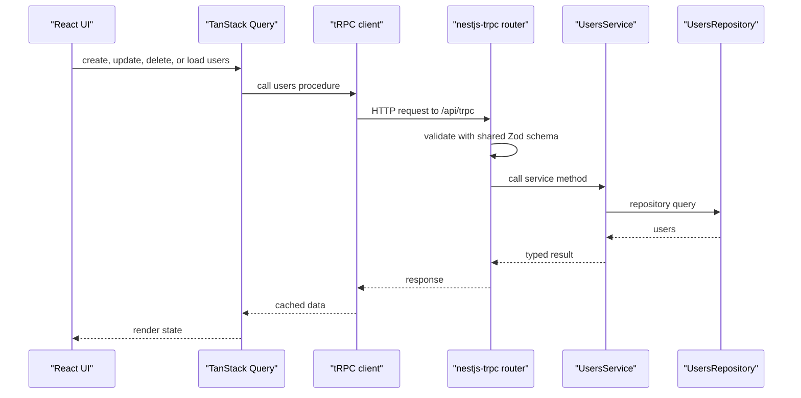

# API

The backend exposes a tRPC API through `nestjs-trpc`.

## Base Path

```text
http://localhost:3001/api/trpc
```

The non-tRPC health endpoint is available at:

```text
GET http://localhost:3001/health
```

This is a Terminus readiness check for PostgreSQL and Redis. It returns `200` when
both dependencies respond and `503` when either check fails. In fixture mode, both
checks are marked as skipped because that mode intentionally runs without external
services.

The tRPC router implementation currently lives in:

```text
apps/backend/src/users/users.router.ts
apps/backend/src/event-listings/event-listings.router.ts
apps/backend/src/events/events.router.ts
apps/backend/src/registrations/registrations.router.ts
```

Generated client router types live in:

```text
packages/schemas/src/@generated/server.ts
```

Regenerate them with:

```bash
vp run trpc:generate
```

## Current Router

The current router aliases are:

```text
eventCreation, events, friends, presence, registrations, users
```

| Procedure                           | Type         | Access         | Notes                                                                          |
| ----------------------------------- | ------------ | -------------- | ------------------------------------------------------------------------------ |
| `events.getEvents`                  | Query        | Public         | Reads and sorts events.                                                        |
| `events.getMyRegisteredEvents`      | Query        | Authenticated  | Lists the current user's active registrations as events, soonest first.        |
| `registrations.register`            | Mutation     | Authenticated  | Registers the current user using the shared registration input schema.         |
| `registrations.cancel`              | Mutation     | Authenticated  | Cancels the current user's active registration; rejects missing registrations. |
| `registrations.getMyRegistration`   | Query        | Public         | Returns the current user's active registration, or null without a session.     |
| `registrations.getAvailableTickets` | Query        | Public         | Returns the event's remaining capacity.                                        |
| `registrations.getEventAttendees`   | Query        | Organizer      | Lists the event's active attendees.                                            |
| `eventCreation.getEventById`        | Query        | Public         | Reads one event.                                                               |
| `eventCreation.getMyEvents`         | Query        | Authenticated  | Lists the events the current user organizes.                                   |
| `eventCreation.onEventChanged`      | Subscription | Public         | Streams event create/update/delete plus a heartbeat.                           |
| `eventCreation.createEvent`         | Mutation     | Authenticated  | Creates an event owned by the current user.                                    |
| `eventCreation.updateEvent`         | Mutation     | Owner or admin | Updates an event after checking organizer ownership.                           |
| `eventCreation.deleteEvent`         | Mutation     | Owner or admin | Deletes an event and its registrations.                                        |
| `users.getUsers`                    | Query        | Authenticated  | Reads the user directory.                                                      |
| `users.getMe`                       | Query        | Public         | Returns the current user, or `null`.                                           |
| `users.updateUser`                  | Mutation     | Self or admin  | Updates profile fields.                                                        |
| `users.createUser`                  | Mutation     | Admin          | Legacy passwordless user creation procedure.                                   |
| `users.adminUpdateUser`             | Mutation     | Admin          | Updates any user, including their Better Auth role.                            |
| `users.deleteUser`                  | Mutation     | Admin          | Deletes a user; cascades remove related owned records.                         |
| `users.onUserCreated/Updated/...`   | Subscription | Admin          | Streams user lifecycle changes.                                                |

Better Auth's admin plugin additionally exposes its user-management API below `/api/auth/admin/*`.
The dashboard's tRPC procedures authorize exclusively against Better Auth's `role` model.

## My Tickets

The `/my-tickets` page lists active registrations through `events.getMyRegisteredEvents`.
It distinguishes an empty ticket list, with a localized Browse Events link, from a search
with no matches. An expired session causes the listing query to reject with `UNAUTHORIZED`.

Both My Tickets and the event detail page cancel through `registrations.cancel`, using
`createRegistrationSchema` and `CreateRegistrationDto` from `@repo/schemas/registrations`.
There is no separate cancellation mutation in event listings. Cancellation rejects an
expired session with `UNAUTHORIZED` and a missing active registration with `CONFLICT`.

The shared `useRegistrationMutations` hook refreshes My Tickets, event listings, featured
events, and the affected event's registration, availability, and attendee queries after
successful registration or cancellation. Inactive cached queries are marked stale so they
refresh when their page reopens. Mutation progress and result toasts come from the shared
TanStack Query mutation cache; the pages do not create a second set of mutation toasts.

## Shared Contracts

User input/output contracts are imported from:

```text
@repo/schemas/users
@repo/schemas/events
```

The frontend calls these procedures through TanStack Query and `@trpc/tanstack-react-query`.

The backend validates inputs through `nestjs-trpc` decorators before data reaches the service layer.



## Realtime Subscriptions

Realtime updates use tRPC subscriptions over the existing `/api/trpc` endpoint. The frontend routes subscription operations through `httpSubscriptionLink` and keeps queries/mutations on `httpBatchLink`.

Backend subscription procedures should stay small and delegate event ownership to a service:

```ts
import { userCreatedSubscriptionSchema } from '@repo/schemas/users';

@Subscription({ output: userCreatedSubscriptionSchema })
async *onUserCreated(@Options() opts: { signal?: AbortSignal }) {
  for await (const user of this.usersEvents.listenUserCreated(opts.signal)) {
    yield user;
  }
}
```

For tRPC v11 subscriptions, the static output type must be an `AsyncIterable` of yielded values. Do not use `output: userSchema` for a subscription that yields users; that describes a single user, not the stream, and the client cannot infer the `onData` payload type.

The tRPC server and every frontend terminating link use `superjson` as the transformer. Keep those settings matched so values like `Date` keep the same type across queries, mutations, and subscriptions.

Internal backend events go through `EventsService`, which wraps Nest's `@nestjs/event-emitter` package. These events are local to the current backend process; Redis is not used for subscription delivery. Domain-specific services, such as `UsersEvents`, should expose named methods like `emitUserCreated()` and `listenUserCreated()` instead of putting raw event names in routers or feature services.

### Heartbeats and Reconnection

A dropped SSE stream is indistinguishable from an idle one: both are silent. So
`EventsService.listenEventChangedWithHeartbeat()` races the domain listener against a timer and
yields `{ action: 'heartbeat' }` every `EVENT_HEARTBEAT_INTERVAL_MS` (10s, exported from
`@repo/schemas/events`) when nothing else has happened. The timer belongs to that generator, so it
is cleared in the same `finally` that ends the listener, per the ownership rule below.

On the client, `useEventStream()` records the time of every message, heartbeats included. If none
arrives within 2.5 intervals it calls the subscription's `reset()` to tear down the dead stream and
open a new one, then invalidates the event queries — changes made while disconnected never reached
this client, so the cache has to be resynced rather than trusted.

This matters because `@trpc/client`'s `httpSubscriptionLink` keeps its status at `pending` after the
server goes away: without the heartbeat the UI would show a live connection that delivers nothing.

### Cleanup Rules

The `AbortSignal` passed by `nestjs-trpc` is how a subscription learns that the client disconnected. `EventsService.listen()` uses that signal to:

- wake any pending listener promise;
- remove the Nest event listener;
- remove its own abort listener;
- end the async generator cleanly.

This cleanup only covers resources opened by `EventsService.listen()` itself. If a feature-level subscription opens another resource, the same service that opens it must close it with `try`/`finally`:

```ts
async *listenUserCreated(signal?: AbortSignal) {
  const resource = await openSomething();

  try {
    for await (const user of this.eventsService.listen<UserDto>('user.created', signal)) {
      yield user;
    }
  } finally {
    await resource.close();
  }
}
```

The ownership rule is: whoever opens a resource closes it. The shared `EventsService` deduplicates event listener and abort handling, while feature services remain responsible for database cursors, timers, sockets, file handles, or other resources they create.
