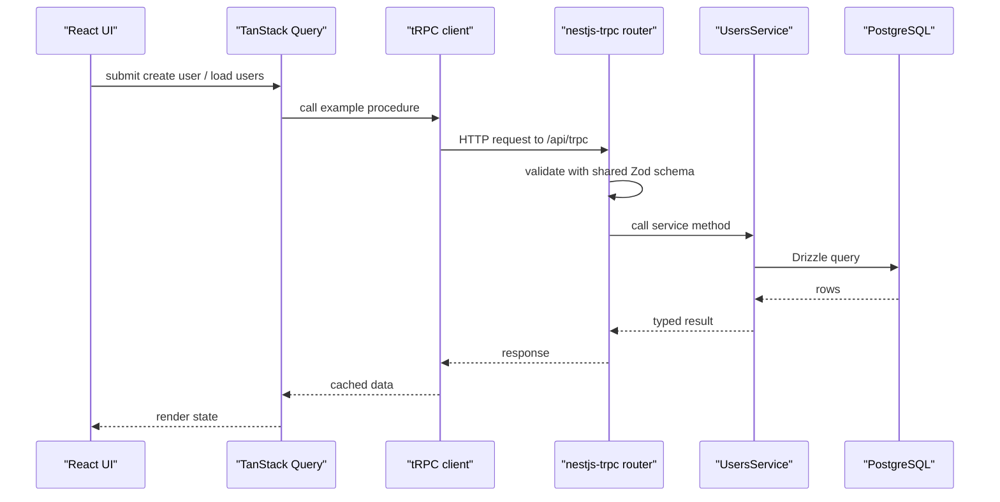

# API

The backend exposes a tRPC API through `nestjs-trpc`.

## Base Path

```text
http://localhost:3001/api/trpc
```

The tRPC router implementation currently lives in:

```text
apps/backend/src/trpc.router.ts
```

Generated client router types live in:

```text
packages/schemas/src/@generated/server.ts
```

Regenerate them with:

```bash
vp run trpc:generate
```

## Current Router

The current router alias is:

```text
example
```

| Procedure            | Type     | Input              | Output                  | Notes                                                 |
| -------------------- | -------- | ------------------ | ----------------------- | ----------------------------------------------------- |
| `example.getTodos`   | Query    | None               | Array of `{ id, name }` | Temporary example data.                               |
| `example.getUsers`   | Query    | None               | Array of users          | Reads users from PostgreSQL through Drizzle.          |
| `example.createUser` | Mutation | `createUserSchema` | User                    | Creates a user and rejects duplicate email addresses. |

## Shared Contracts

User input/output contracts are imported from:

```text
@repo/schemas/users
```

The frontend calls these procedures through TanStack Query and `@trpc/tanstack-react-query`.

The backend validates inputs through `nestjs-trpc` decorators before data reaches the service layer.


