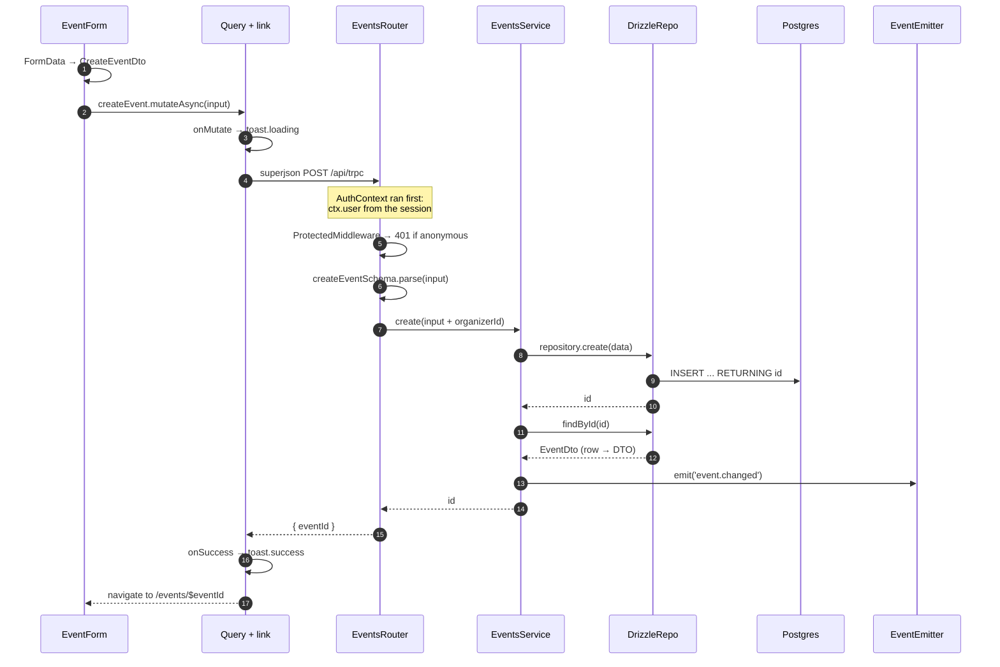
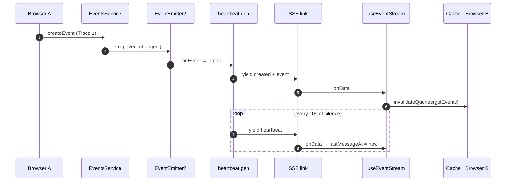
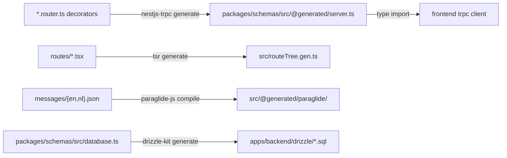
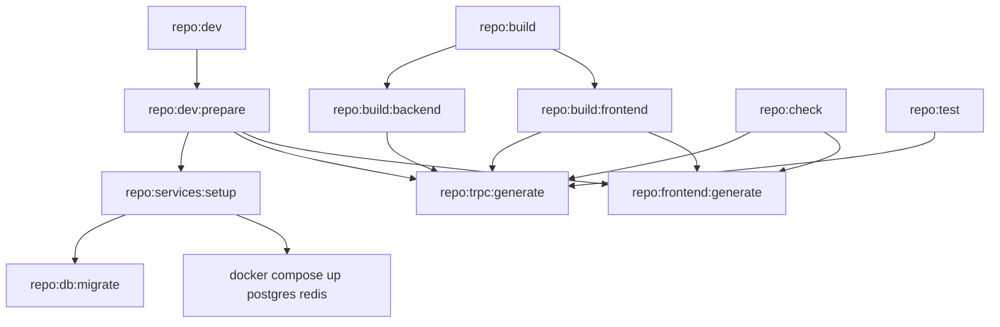

# Architecture Tour

The other docs in `docs/` each describe **one** subsystem. This one describes how they **connect** —
what the layers are, which file owns which responsibility, and what actually happens end-to-end when
a user clicks a button.

Read this once top to bottom, then use it as a map. If you only have ten minutes, read
[The one-paragraph version](#the-one-paragraph-version) and
[Trace 1: creating an event](#trace-1-creating-an-event).

## Table of contents

- [The one-paragraph version](#the-one-paragraph-version)
- [The shape of the system](#the-shape-of-the-system)
- [Layer map: who owns what](#layer-map-who-owns-what)
  - [`packages/schemas` — the spine](#packagesschemas--the-spine)
  - [`apps/backend` — NestJS](#appsbackend--nestjs)
  - [`apps/frontend` — TanStack Start](#appsfrontend--tanstack-start)
- [The tRPC surface](#the-trpc-surface)
- [Vertical traces](#vertical-traces)
  - [Trace 1: creating an event](#trace-1-creating-an-event)
  - [Trace 2: logging in and being recognised](#trace-2-logging-in-and-being-recognised)
  - [Trace 3: a change reaching every open browser](#trace-3-a-change-reaching-every-open-browser)
- [Code generation: the three generated artifacts](#code-generation-the-three-generated-artifacts)
- [The task graph](#the-task-graph)
- [Runtime topology](#runtime-topology)
- [Sharp edges](#sharp-edges)

---

## The one-paragraph version

`packages/schemas` is the spine. It holds the Drizzle table definitions **and** the Zod schemas, and
both apps import it. The backend is a NestJS app whose tRPC routers are decorated classes; a
generator reads those decorators and writes a type-only tRPC router into
`packages/schemas/src/@generated/server.ts`. The frontend imports that generated type and gets a
fully typed client with no shared runtime code and no HTTP client hand-written anywhere. Data flows
`route loader → TanStack Query → tRPC link → NestJS router → service → repository → Drizzle →
Postgres`, and comes back the same way. Writes additionally emit an in-process domain event which is
pushed to every connected browser over an SSE subscription.

---

## The shape of the system


Three things are worth noticing in that picture:

1. **The frontend talks to the backend from two places** — the browser, and the frontend's own
   Node server during SSR. That is why `root-provider.tsx` forwards the incoming `cookie` header when
   `typeof window === 'undefined'`, and why `getUrl()` prefers `SERVER_URL` on the server and
   `VITE_API_URL` in the browser (inside Docker they are different hosts: `http://backend:3001`
   vs `http://localhost:3001`).
2. **`packages/schemas` is imported by everything but imports nothing of the apps.** It is the only
   shared code. There is no shared "types" package, no duplicated DTOs.
3. **Redis is not on the request path for realtime.** It backs the cache and the rate limiter only.
   Subscriptions are delivered by an in-process `EventEmitter2`, which means realtime works with a
   single backend instance and would need work to scale horizontally.

---

## Layer map: who owns what

### `packages/schemas` — the spine

| File                                                                                       | What it holds                                                                                                                                                                                                                                 |
| ------------------------------------------------------------------------------------------ | --------------------------------------------------------------------------------------------------------------------------------------------------------------------------------------------------------------------------------------------- |
| `src/database.ts`                                                                          | Every Drizzle table: `users`, `sessions`, `accounts`, `verifications`, `twoFactors`, `events`, `friends`, `registrations`. Also the `schema` object and `$inferSelect`/`$inferInsert` types. **The single source of truth for the database.** |
| `src/users.ts`                                                                             | Zod schemas _derived from_ the table via `drizzle-zod` (`createSelectSchema`, `createInsertSchema`).                                                                                                                                          |
| `src/events.ts`                                                                            | Zod schemas written **by hand**, not derived. See [Sharp edges](#sharp-edges).                                                                                                                                                                |
| `src/friends.ts`, `src/registrations.ts`, `src/presence.ts`, `src/stats.ts`, `src/auth.ts` | Per-feature Zod schemas + DTO types.                                                                                                                                                                                                          |
| `src/@generated/server.ts`                                                                 | **Generated.** A type-only mirror of the backend's tRPC router.                                                                                                                                                                               |

Consumed through explicit subpath exports declared in `packages/schemas/package.json` — you import
`@repo/schemas/events`, never `@repo/schemas` with a deep relative path. The bare `.` entrypoint only
re-exports `registrations`, so it is effectively unused.

Note the naming split: the _Drizzle row type_ is `Event` (from `database.ts`) while the _wire type_
is `EventDto` (from `events.ts`). They are **not the same shape**, and translating between them is the
repository's job.

### `apps/backend` — NestJS

Every feature module follows the same five-file shape:

```
<feature>/
  <feature>.module.ts                       ← wiring; often a DynamicModule with .register()
  <feature>.router.ts                       ← tRPC procedures (decorated class)
  <feature>.service.ts                      ← business logic, emits domain events
  <feature>.events.ts                       ← named emit/listen methods (optional)
  repositories/
    <feature>.repository.ts                 ← abstract class = the interface
    drizzle-<feature>.repository.ts         ← Postgres implementation
    in-memory-<feature>.repository.ts       ← fixtures implementation (optional)
```

The **abstract class as interface** trick is central. `EventsRepository` is an `abstract class`, not a
TypeScript `interface`, because Nest needs a runtime value to use as a DI token:

```ts
// event-listings.module.ts
providers: [{ provide: EventListingsRepository, useClass: repository }];
```

`repository` is chosen inside `static register({ persistence })`, and `AppModule` passes
`environment.DEV_FIXTURES ? 'fixtures' : 'database'`. The service never knows which one it got.

**Only three modules are actually swappable**: `UsersModule`, `EventListingsModule`, `FriendsModule`.
`EventsModule`, `RegistrationsModule` and `PresenceModule` are plain `@Module`s that import
`DatabaseModule` unconditionally.

Infrastructure modules:

| Module                                   | Role                                                                                                                                                                                             |
| ---------------------------------------- | ------------------------------------------------------------------------------------------------------------------------------------------------------------------------------------------------ |
| `database/`                              | Owns the `pg.Pool` and the Drizzle client, provided under the `DATABASE` token. `DatabaseService.ping()` backs the health check; `onApplicationShutdown` closes the pool.                        |
| `auth/`                                  | Builds the Better Auth instance (`auth.instance.ts`), exposes it under the `AUTH` token, provides the tRPC context (`auth.context.ts`) and the `ProtectedMiddleware` / `AdminMiddleware` guards. |
| `events/`                                | Double duty — see [Sharp edges](#sharp-edges). `EventsService` is _both_ the event-CRUD service _and_ the process-wide pub/sub bus (`emit` / `listen`).                                          |
| `health/`, `notification/`, `templates/` | Health indicators for Postgres and Redis; transactional email via `@nestjs-modules/mailer`; hand-built HTML email templates.                                                                     |

`main.ts` ordering is load-bearing and commented as such:

```
NestFactory.create({ bodyParser: false })   ← Nest's parser off
  → app.enableCors(...)                     ← must precede Better Auth (preflight shadowing)
  → app.use('/api/auth', toNodeHandler)     ← must precede body parsing (reads raw body)
  → app.use(express.json({ limit: '2mb' })) ← 2mb because images arrive as data URLs
  → app.enableShutdownHooks()
```

### `apps/frontend` — TanStack Start

| Path                                                                 | Role                                                                                                                                                                                                                                                                   |
| -------------------------------------------------------------------- | ---------------------------------------------------------------------------------------------------------------------------------------------------------------------------------------------------------------------------------------------------------------------- |
| `routes/`                                                            | File-based routes. `__root.tsx` defines the router context (`{ queryClient, trpc }`), resolves the session in `beforeLoad`, and renders the shell (`Navbar` / `main` / `Footer` / `Toaster` / devtools).                                                               |
| `integrations/trpc/react.ts`                                         | Three lines. Creates the typed `useTRPC()` hook from the generated `AppRouter`.                                                                                                                                                                                        |
| `integrations/tanstack-query/root-provider.tsx`                      | The real integration point: builds the tRPC client with a `splitLink` (SSE for subscriptions, batched HTTP otherwise), builds the `QueryClient`, and installs a global `MutationCache` that turns **every** mutation into a loading/success/error toast automatically. |
| `hooks/use-event-stream.ts`, `use-presence.ts`, `use-user-stream.ts` | Subscription hooks that write incoming pushes into the Query cache.                                                                                                                                                                                                    |
| `lib/auth-client.ts`                                                 | Better Auth React client with the `admin`, `username`, `twoFactor` plugins — mirroring the server plugin list exactly.                                                                                                                                                 |
| `lib/auth-session.functions.ts`                                      | A `createServerFn` that reads the session server-side, forwarding the request cookie. Deliberately returns `null` rather than throwing.                                                                                                                                |
| `components/ui/*`                                                    | shadcn primitives. Compose from these before writing new UI.                                                                                                                                                                                                           |
| `@generated/paraglide/`                                              | **Generated** i18n runtime and `messages` object.                                                                                                                                                                                                                      |

The global mutation toast is easy to miss and explains a lot of behaviour: `mutationToastMessages()`
inspects the mutation key for substrings like `create`, `delete`, `update` and picks the message. So
a new mutation named `...createFoo` gets "Creating…/Created" for free, and a mutation named something
unexpected falls back to "Working…/Complete".

---

## The tRPC surface

Six routers. The `alias` in `@Router({ alias: ... })` is the client namespace.

| Alias           | Class                 | Procedures                                                                                                                                          |
| --------------- | --------------------- | --------------------------------------------------------------------------------------------------------------------------------------------------- |
| `events`        | `EventListingsRouter` | `getEvents(sort)`, `getFeaturedEvents()`, `getEventStats()` — all public reads                                                                      |
| `eventCreation` | `EventsRouter`        | `createEvent` 🔒, `getEventById`, `getMyEvents` 🔒, `updateEvent` 🔒, `deleteEvent` 🔒, `onEventChanged` (subscription, public)                     |
| `users`         | `UsersRouter`         | `createUser` 👑, `getUsers` 🔒, `getMe`, `updateUser` 🔒, `adminUpdateUser` 👑, `deleteUser` 👑, `onUserCreated`/`onUserUpdated`/`onUserDeleted` 👑 |
| `friends`       | `FriendsRouter`       | `getFriends`, `getPendingRequests`, `addFriend`, `acceptFriend`, `removeFriend`                                                                     |
| `presence`      | `PresenceRouter`      | `getOnlineUserIds`, `onPresenceChanged` (subscription)                                                                                              |
| `registrations` | `RegistrationsRouter` | _(empty — the class has no procedures yet)_                                                                                                         |

🔒 = `ProtectedMiddleware`, 👑 = `AdminMiddleware`.

Two guard styles coexist. `EventsRouter` and `UsersRouter` use `@UseMiddlewares(...)`, which narrows
the context type for the whole procedure. `FriendsRouter` and `PresenceRouter` instead take
`@Ctx() ctx: { user: ... | null }` and throw `unauthorizedError()` by hand. The middleware form is
the one to copy.

Authorisation beyond "is logged in" lives in the router, not the service — see `assertCanManage()` in
`events.router.ts`, which loads the event and compares `organizerId` against `ctx.user.id` unless the
user has the `admin` role. Roles are stored as a comma-joined string, hence `role?.split(',').includes('admin')`.

---

## Vertical traces

### Trace 1: creating an event

The single most useful path to internalise — it touches every layer once.



Follow it in the files:

1. **`routes/create-event.tsx`** — `beforeLoad` reads `context.session` (put there by `__root.tsx`)
   and redirects to `/login` if absent. This is a UX guard only; the real check is server-side.
2. **`components/events/EventForm.tsx`** — builds the payload from a raw `FormData` and calls
   `useMutation(trpc.eventCreation.createEvent.mutationOptions())`. `date` and `time` are separate
   strings here.
3. **`root-provider.tsx`** — `splitLink` routes this (a mutation, not a subscription) to
   `httpBatchLink`, which serialises with **superjson** and calls `fetch` with `credentials: 'include'`
   so the session cookie rides along. A `413` is translated into a friendly "request too large" —
   images are data URLs, hence the 2 MB Express limit.
4. **`auth/auth.context.ts`** — runs for _every_ tRPC call, resolves the Better Auth session from the
   request headers, and puts `{ session, user }` into `ctx`.
5. **`events/events.router.ts`** — `ProtectedMiddleware` rejects anonymous callers;
   `createEventSchema` validates the input **again** server-side (the same schema object the client
   type came from); `organizerId` is taken from the session, never from the request body.
6. **`events/events.service.ts`** — inserts, then **re-reads the row** before broadcasting, so
   subscribers receive the stored event (with its `id` and normalised date/time) rather than the raw
   input.
7. **`repositories/drizzle-events.repository.ts`** — the shape translation happens here:
   `date` + `time` → `new Date(\`${date}T${time}\`)`into the`dateTime`timestamp column, and`description`→`{ en: description }`into a`jsonb` column that is translation-ready.
8. Back out: `{ eventId }` → `createEventResultSchema` → superjson → the global success toast →
   `navigate({ to: '/events/$eventId' })`.

### Trace 2: logging in and being recognised

Authentication does **not** go through tRPC. It is a separate Express handler mounted on the same
port.


Key points:

- **Passwords live in `accounts.password`, not `users`.** `users` holds only profile data plus the
  Better Auth extras (`banned`, `role`, `twoFactorEnabled`, …).
- **The session is resolved twice per page**, by two independent mechanisms: the frontend server
  function (for route guards and rendering) and `AuthContext` (for authorising tRPC calls). They do
  not share state. The tRPC one is authoritative; the route one is convenience.
- **`getAuthSession` swallows errors on purpose.** It runs in the root `beforeLoad`, so a throw would
  fail the entire route tree, the CatchBoundary would rebuild it, and an unreachable backend would put
  the app into a remount loop. Returning `null` degrades to "logged out" instead.
- **Plugin lists must match.** `auth.instance.ts` enables `admin()`, `username()`, `twoFactor()`;
  `auth-client.ts` enables `adminClient()`, `usernameClient()`, `twoFactorClient()`. Adding one
  without the other silently breaks that feature's client methods.
- **The `users.image` column is mapped to `avatar`** via `user.fields`, and `aboutMe` / `location` /
  `preferedLanguage` are declared as `additionalFields` so Better Auth will accept them on update.

### Trace 3: a change reaching every open browser

This is what makes the app feel live, and it is the most intricate part of the codebase.



Server side, `EventsService` provides three layers:

- **`emit()` / `listen()`** — a generic bridge from `EventEmitter2` (callback-based) to an
  `AsyncGenerator` (pull-based). `listen()` buffers up to `MAX_BUFFERED_EVENTS = 100`, throws if a
  slow consumer overflows it, and removes its listener in a `finally` when the `AbortSignal` fires.
- **`listenEventChanged()`** — the typed, named wrapper. Routers never see the string
  `'event.changed'`; it exists in exactly one place. `UsersEvents` and `PresenceEvents` are separate
  classes following the same convention on top of the same bus.
- **`listenEventChangedWithHeartbeat()`** — races the change stream against a 10 s timer and yields
  `{ action: 'heartbeat' }` when the timer wins. Its own timer is its own resource, so it clears it in
  a `finally` and calls `changes.return?.()` to close the inner generator.

The heartbeat exists because **a dead SSE stream and an idle SSE stream look identical**. Client side,
`useEventStream` runs a 5 s watchdog; if nothing has arrived for 25 s (2.5 missed heartbeats) it
marks the stream stale, calls `reset()` to tear down and resubscribe, and invalidates the lists —
because anything that changed while disconnected was never delivered.

Two details in that hook are worth reading the comments for:

- **`lastMessageAt` is module scope, not a ref.** A ref resets on remount, and an unreachable backend
  can remount the tree repeatedly, which would push the deadline forward forever and hide the outage.
- **Updates and deletes are patched into the cache; creates trigger a refetch.** An update cannot
  change an event's position under any of the server's sort orders, so patching is safe. A create
  can, and the DTO carries neither `createdAt` nor `registrationsCount`, so the client cannot place
  the row itself. Still push-driven — just push-triggered-refetch rather than push-applied.

Presence works the same way but with connection counting: `PresenceService` keeps a
`Map<userId, Set<connectionId>>`, and only the first connection emits `online: true` / the last
disconnect emits `offline`. The router yields the client's own `online` event directly before
entering the listen loop, because the broadcast listener only registers once the loop starts — so the
client would otherwise miss its own event.

---

## Code generation: the three generated artifacts

None of these are hand-editable. All three are regenerated by tasks that other tasks depend on.



| Artifact                                    | Produced by            | Triggered by                                                              |
| ------------------------------------------- | ---------------------- | ------------------------------------------------------------------------- |
| `packages/schemas/src/@generated/server.ts` | `nestjs-trpc generate` | `vp run trpc:generate`; a `dependsOn` of every build/test/check/lint task |
| `apps/frontend/src/routeTree.gen.ts`        | `tsr generate`         | `repo:frontend:generate`                                                  |
| `apps/frontend/src/@generated/paraglide/`   | `paraglide-js compile` | `repo:frontend:generate`                                                  |
| `apps/backend/drizzle/*.sql`                | `drizzle-kit generate` | `vp run db:generate`, **manually** — not automatic                        |

The migration one is the exception: it is never run for you. Change `database.ts`, run
`vp run db:generate`, review the SQL, commit it. Never edit the SQL by hand.

The generated `server.ts` is worth opening once. It is a _fake_ router — every procedure body is
`async () => 'PLACEHOLDER_DO_NOT_REMOVE' as any`. Only the input/output schema wiring is real,
because only the **type** is ever used. It imports the same Zod schema objects the backend imports,
which is why the client and server can never drift.

---

## The task graph

Everything is orchestrated by `vite.config.ts` (Vite+), not by per-package scripts. Root
`package.json` scripts are thin aliases: `bun dev` → `vp run -w repo:dev`.



The pattern: **anything that reads types depends on `repo:trpc:generate`.** That is why a fresh
checkout can typecheck without you running a codegen step manually.

Three dev modes, in increasing infrastructure cost:

| Command            | Postgres | Redis | Notes                                                                                                           |
| ------------------ | -------- | ----- | --------------------------------------------------------------------------------------------------------------- |
| `bun dev:fixtures` | ✗        | ✗     | In-memory repos. Only users / event-listings / friends are swappable, so event **creation** still needs the DB. |
| `bun dev:frontend` | ✗        | ✗     | Frontend only; tRPC calls fail unless a backend is running elsewhere.                                           |
| `bun dev`          | ✓        | ✓     | The real thing: Docker services, migrations, all three codegens, both dev servers in parallel.                  |

The `vite.config.ts` shell snippets that look cryptic (`$(if [ -f /.dockerenv ]; …)`) exist so the
same task works from a host shell (`localhost`) and from inside a devcontainer (`postgres` /
`redis` service names).

## Runtime topology

| Process                           | Port        | Started by                                                                |
| --------------------------------- | ----------- | ------------------------------------------------------------------------- |
| Frontend (TanStack Start / Nitro) | 3000        | `vp run dev`                                                              |
| Backend (NestJS on Express)       | 3001        | `vp run dev`                                                              |
| Postgres 17                       | 5432        | `docker compose`                                                          |
| Redis 8                           | 6380 → 6379 | `docker compose` (host port shifted to avoid clashing with a local Redis) |

Backend routes: `/api/trpc` (tRPC), `/api/auth/*` (Better Auth), `/health` (Terminus, with Postgres
and Redis indicators).

Environment precedence, earlier wins:
`apps/backend/.env` → `.env` → `apps/backend/.env.development` → `.env.development`.
Frontend variables must be prefixed `VITE_` and are validated by `@t3-oss/env-core`.

---

## Sharp edges

Things that will confuse you, in rough order of how quickly you will hit them.

**Two modules both called "events", plus a third meaning of the word.**

- `event-listings/` — the **read** side. Router alias `events`. Lists, featured, stats. Swappable persistence.
- `events/` — the **write** side. Router alias `eventCreation`. Create/update/delete/detail + the realtime subscription. Database-only.
- `events/events.service.ts` — _also_ the generic **domain-event bus** (`emit`/`listen`) that `UsersEvents` and `PresenceEvents` build on.

So `trpc.events.getEvents` and `trpc.eventCreation.createEvent` are the same domain, split across two
routers. Both list-reading repositories compute `registrationsCount` via a `leftJoin` + `groupBy`,
which is why the listings side has its own repository at all.

**The DTO is not the row.** `EventDto` has `date` and `time` as separate strings and `description` as
a plain string. The `events` table has a `dateTime` timestamp and a `jsonb` description keyed by
locale. The mapping lives in both event repositories (`toDto`, and the inline mapping in the
listings repository). Change one shape and you must change all of them.

**`events.ts` schemas are hand-written, not `drizzle-zod`-derived.** `users.ts` uses
`createSelectSchema(users)` and therefore tracks the table automatically. `events.ts` does not. Adding
a column to the `events` table will **not** surface it in `EventDto`, and nothing will fail — you
just get a field that silently never reaches the client.

**Client-side validation is not universal.** `docs/VALIDATION.md` describes TanStack Form validating
with the shared schema. That is true for the auth forms (`LoginForm`, `CreateAccountForm`,
`ResetPasswordForm`, `ForgotPasswordForm`, `Verify2FAForm`) and `/example`. `EventForm` uses a raw
`FormData` and relies on HTML `required` plus server-side validation. Both are safe — the server
always validates — but only one gives inline field errors.

**`DEV_FIXTURES=true` does not fully remove Postgres.** `EventsModule`, `RegistrationsModule`,
`PresenceModule` and `AuthModule` all import `DatabaseModule` unconditionally. Fixtures mode is
useful for browsing listings and users without Docker, not for exercising the whole app.

**The generated `server.ts` contains an absolute local path.** It ends with
`import type { EventsRouter } from '/home/corin/projects/...'`. It is regenerated on every task that
depends on it, so it self-heals, but expect noisy diffs if it is ever committed from a different
machine.

**`RegistrationsRouter` is an empty class.** The table, the FK from `events`, and the
`registrationsCount` aggregation all exist; the API surface does not yet.

**Realtime is single-instance.** `EventEmitter2` is process-local. Two backend replicas would each
serve their own subscribers and never see each other's emits. `docs/API.md` is explicit that Redis is
not used for subscription delivery.

**Two docs are currently out of date** (worth fixing when you touch them):

- `CLAUDE.md` says routes live under `src/routes/$locale/*`. They do not — routing is flat
  (`routes/index.tsx`, `routes/events/index.tsx`, …) and Paraglide uses the
  `--strategy url baseLocale` URL strategy instead of a locale route segment.
- `CLAUDE.md` describes `users.createUser` as a "legacy unauthenticated" mutation. It is now guarded
  by `AdminMiddleware`. The two-user-creation-paths caveat still holds: a user created this way has
  no row in `accounts` and therefore cannot log in.
- `project.inlang/settings.json` registers `en` and `nl` only, but `messages/es.json` exists and is
  not compiled.

---

## Where to go next

- `docs/API.md` — the full tRPC surface and subscription conventions.
- `docs/AUTHENTICATION.md` — why the `main.ts` ordering is what it is.
- `docs/VALIDATION.md` — the schema-first flow in the abstract.
- `docs/DATABASE.md` — migration workflow.
- `docs/MONOREPO.md` / `docs/TOOLING.md` — workspaces and Vite+ tasks.
