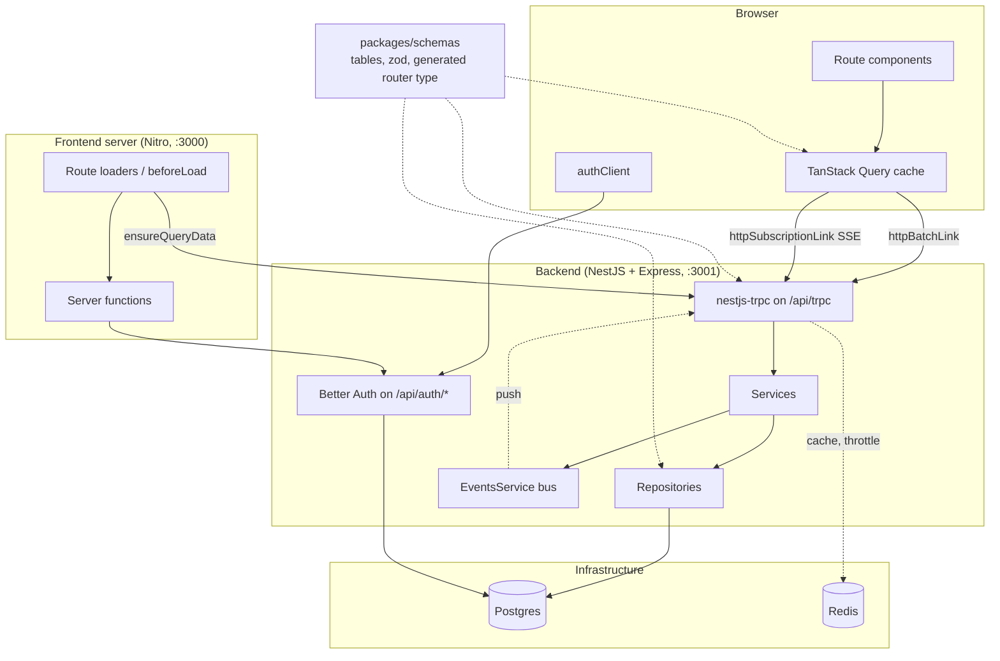
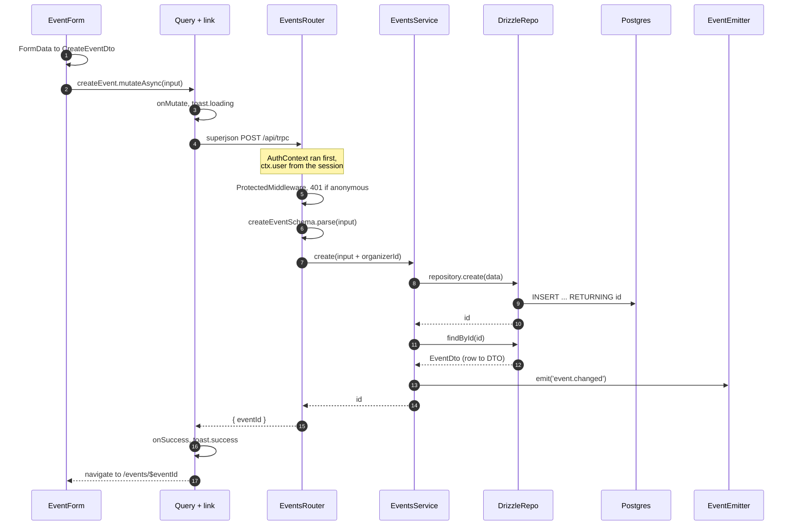
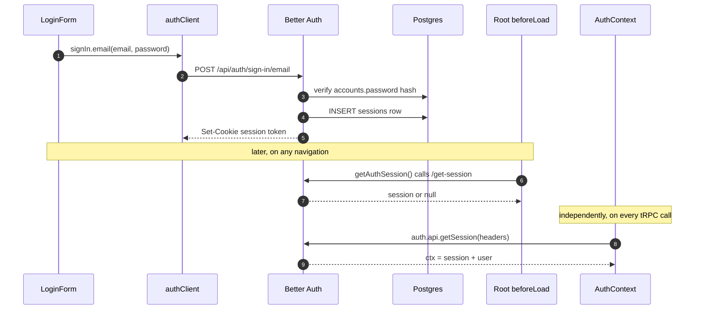
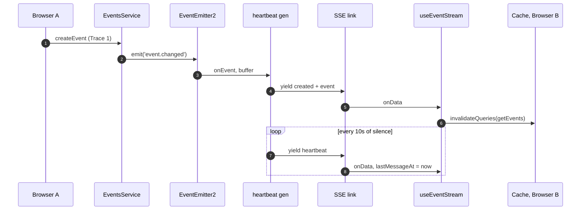
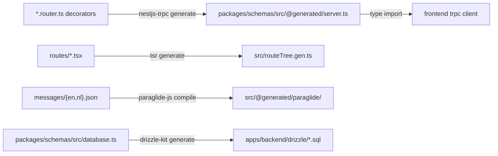
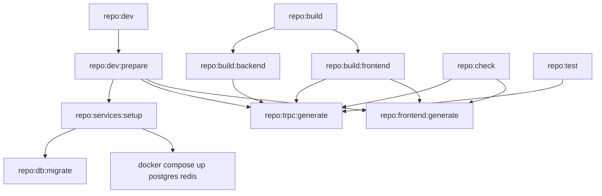

# Architecture Tour

Each of the other docs in `docs/` covers one subsystem. This one covers how they connect: what the
layers are, which file owns which responsibility, and what happens end to end when a user clicks a
button.

Read it once top to bottom, then come back to it for reference. If you have ten minutes, read
[The one-paragraph version](#the-one-paragraph-version) and
[Trace 1: creating an event](#trace-1-creating-an-event).

## Table of contents

- [The one-paragraph version](#the-one-paragraph-version)
- [The shape of the system](#the-shape-of-the-system)
- [Which file owns what](#which-file-owns-what)
  - [`packages/schemas`](#packagesschemas)
  - [`apps/backend` (NestJS)](#appsbackend-nestjs)
  - [`apps/frontend` (TanStack Start)](#appsfrontend-tanstack-start)
- [The tRPC routers](#the-trpc-routers)
- [End-to-end traces](#end-to-end-traces)
  - [Trace 1: creating an event](#trace-1-creating-an-event)
  - [Trace 2: logging in and staying logged in](#trace-2-logging-in-and-staying-logged-in)
  - [Trace 3: a change reaching every open browser](#trace-3-a-change-reaching-every-open-browser)
- [Generated files](#generated-files)
- [The task graph](#the-task-graph)
- [What runs where](#what-runs-where)
- [Gotchas](#gotchas)

---

## The one-paragraph version

Both apps import `packages/schemas`, and it imports neither of them. It holds the Drizzle table
definitions and the Zod schemas. The backend is a NestJS app whose tRPC routers are decorated
classes. A generator reads those decorators and writes a type-only tRPC router into
`packages/schemas/src/@generated/server.ts`. The frontend imports that type and gets a typed client,
with no shared runtime code and no hand-written HTTP client. A read starts in a route loader and
passes through TanStack Query, the tRPC link, a NestJS router, a service, a repository and Drizzle
before it reaches Postgres, then returns the same way. A write also emits an in-process domain event,
which the backend pushes to every connected browser over an SSE subscription.

---

## The shape of the system



Three things in that diagram are easy to miss:

1. **The frontend calls the backend from two places.** The browser calls it, and so does the
   frontend's own Node server during SSR. That is why `root-provider.tsx` forwards the incoming
   `cookie` header when `typeof window === 'undefined'`, and why `getUrl()` prefers `SERVER_URL` on
   the server and `VITE_API_URL` in the browser. Inside Docker those are different hosts,
   `http://backend:3001` against `http://localhost:3001`.
2. **Everything imports `packages/schemas`, and it imports nothing back.** It is the only shared
   code. There is no shared types package and no duplicated DTOs.
3. **Redis is not on the request path for realtime.** It backs the cache and the rate limiter only.
   An in-process `EventEmitter2` delivers subscriptions, so realtime works with one backend instance
   and would need changing to run more than one.

---

## Which file owns what

### `packages/schemas`

| File                                                                                       | What it holds                                                                                                                                                                                                                                    |
| ------------------------------------------------------------------------------------------ | ------------------------------------------------------------------------------------------------------------------------------------------------------------------------------------------------------------------------------------------------ |
| `src/database.ts`                                                                          | Every Drizzle table: `users`, `sessions`, `accounts`, `verifications`, `twoFactors`, `events`, `friends`, `registrations`. Also the `schema` object and the `$inferSelect` / `$inferInsert` types. This is the source of truth for the database. |
| `src/users.ts`                                                                             | Zod schemas derived from the table with `drizzle-zod` (`createSelectSchema`, `createInsertSchema`).                                                                                                                                              |
| `src/events.ts`                                                                            | Zod schemas written by hand, not derived from the table. See [Gotchas](#gotchas).                                                                                                                                                                |
| `src/friends.ts`, `src/registrations.ts`, `src/presence.ts`, `src/stats.ts`, `src/auth.ts` | Per-feature Zod schemas and DTO types.                                                                                                                                                                                                           |
| `src/@generated/server.ts`                                                                 | Generated. A type-only copy of the backend's tRPC router.                                                                                                                                                                                        |

`packages/schemas/package.json` declares explicit subpath exports. You import `@repo/schemas/events`,
never `@repo/schemas` with a deep relative path. The bare `.` entrypoint re-exports only
`registrations`, so nothing uses it.

The names split by layer. The Drizzle row type is `Event`, from `database.ts`. The wire type is
`EventDto`, from `events.ts`. They are different shapes, and the repository translates between them.

### `apps/backend` (NestJS)

Every feature module has the same shape:

```
<feature>/
  <feature>.module.ts                       wiring; often a DynamicModule with .register()
  <feature>.router.ts                       tRPC procedures (decorated class)
  <feature>.service.ts                      business logic, emits domain events
  <feature>.events.ts                       named emit/listen methods (optional)
  repositories/
    <feature>.repository.ts                 abstract class, used as the interface
    drizzle-<feature>.repository.ts         Postgres implementation
    in-memory-<feature>.repository.ts       fixtures implementation (optional)
```

`EventsRepository` is an `abstract class` rather than a TypeScript `interface` because Nest needs a
runtime value to use as a DI token:

```ts
// event-listings.module.ts
providers: [{ provide: EventListingsRepository, useClass: repository }];
```

`static register({ persistence })` picks `repository`, and `AppModule` passes
`environment.DEV_FIXTURES ? 'fixtures' : 'database'`. The service never learns which one it got.

Only three modules swap persistence: `UsersModule`, `EventListingsModule` and `FriendsModule`.
`EventsModule`, `RegistrationsModule` and `PresenceModule` are plain `@Module`s that import
`DatabaseModule` unconditionally.

Infrastructure modules:

| Module                                   | Role                                                                                                                                                                                             |
| ---------------------------------------- | ------------------------------------------------------------------------------------------------------------------------------------------------------------------------------------------------ |
| `database/`                              | Owns the `pg.Pool` and the Drizzle client, provided under the `DATABASE` token. `DatabaseService.ping()` backs the health check, and `onApplicationShutdown` closes the pool.                    |
| `auth/`                                  | Builds the Better Auth instance (`auth.instance.ts`), exposes it under the `AUTH` token, provides the tRPC context (`auth.context.ts`) and the `ProtectedMiddleware` / `AdminMiddleware` guards. |
| `events/`                                | Two jobs, see [Gotchas](#gotchas). `EventsService` is both the event-CRUD service and the process-wide pub/sub bus (`emit` / `listen`).                                                          |
| `health/`, `notification/`, `templates/` | Health indicators for Postgres and Redis; transactional email through `@nestjs-modules/mailer`; hand-built HTML email templates.                                                                 |

The order in `main.ts` matters, and the comments in the file say so:

```
NestFactory.create({ bodyParser: false })   Nest's parser off
  app.enableCors(...)                       must precede Better Auth (preflight shadowing)
  app.use('/api/auth', toNodeHandler)       must precede body parsing (reads the raw body)
  app.use(express.json({ limit: '2mb' }))   2mb because images arrive as data URLs
  app.enableShutdownHooks()
```

### `apps/frontend` (TanStack Start)

| Path                                                                 | Role                                                                                                                                                                                                                     |
| -------------------------------------------------------------------- | ------------------------------------------------------------------------------------------------------------------------------------------------------------------------------------------------------------------------ |
| `routes/`                                                            | File-based routes. `__root.tsx` defines the router context (`{ queryClient, trpc }`), resolves the session in `beforeLoad`, and renders the shell (`Navbar`, `main`, `Footer`, `Toaster`, devtools).                     |
| `integrations/trpc/react.ts`                                         | Three lines. Creates the typed `useTRPC()` hook from the generated `AppRouter`.                                                                                                                                          |
| `integrations/tanstack-query/root-provider.tsx`                      | Builds the tRPC client with a `splitLink` (SSE for subscriptions, batched HTTP otherwise), builds the `QueryClient`, and installs a global `MutationCache` that gives every mutation a loading, success and error toast. |
| `hooks/use-event-stream.ts`, `use-presence.ts`, `use-user-stream.ts` | Subscription hooks that write incoming pushes into the Query cache.                                                                                                                                                      |
| `lib/auth-client.ts`                                                 | Better Auth React client with the `admin`, `username` and `twoFactor` plugins. The server enables the same three in `auth.instance.ts`.                                                                                  |
| `lib/auth-session.functions.ts`                                      | A `createServerFn` that reads the session server-side, forwarding the request cookie. Returns `null` instead of throwing.                                                                                                |
| `components/ui/*`                                                    | shadcn primitives. Compose from these before writing new UI.                                                                                                                                                             |
| `@generated/paraglide/`                                              | Generated i18n runtime and `messages` object.                                                                                                                                                                            |

The global mutation toast is easy to miss and explains a lot of behaviour. `mutationToastMessages()`
looks in the mutation key for `create`, `delete` or `update` and picks the wording from that. A
mutation named `...createFoo` gets "Creating…" and "Created" with no extra code; one named anything
else falls back to "Working…" and "Complete".

---

## The tRPC routers

Six routers. The `alias` in `@Router({ alias: ... })` is the client namespace.

| Alias           | Class                 | Procedures                                                                                                                                                                          |
| --------------- | --------------------- | ----------------------------------------------------------------------------------------------------------------------------------------------------------------------------------- |
| `events`        | `EventListingsRouter` | `getEvents(sort)`, `getFeaturedEvents()`, `getEventStats()`, all public reads                                                                                                       |
| `eventCreation` | `EventsRouter`        | `createEvent` (auth), `getEventById`, `getMyEvents` (auth), `updateEvent` (auth), `deleteEvent` (auth), `onEventChanged` (subscription, public)                                     |
| `users`         | `UsersRouter`         | `createUser` (admin), `getUsers` (auth), `getMe`, `updateUser` (auth), `adminUpdateUser` (admin), `deleteUser` (admin), `onUserCreated` / `onUserUpdated` / `onUserDeleted` (admin) |
| `friends`       | `FriendsRouter`       | `getFriends`, `getPendingRequests`, `addFriend`, `acceptFriend`, `removeFriend`                                                                                                     |
| `presence`      | `PresenceRouter`      | `getOnlineUserIds`, `onPresenceChanged` (subscription)                                                                                                                              |
| `registrations` | `RegistrationsRouter` | _(empty, the class has no procedures yet)_                                                                                                                                          |

"auth" means `ProtectedMiddleware`, "admin" means `AdminMiddleware`.

Two guard styles coexist. `EventsRouter` and `UsersRouter` use `@UseMiddlewares(...)`, which narrows
the context type for the whole procedure. `FriendsRouter` and `PresenceRouter` instead take
`@Ctx() ctx: { user: ... | null }` and throw `unauthorizedError()` by hand. Copy the middleware form.

Authorisation beyond "is the caller logged in" lives in the router, not the service. See
`assertCanManage()` in `events.router.ts`, which loads the event and compares `organizerId` against
`ctx.user.id` unless the user has the `admin` role. Roles are stored as a comma-joined string, hence
`role?.split(',').includes('admin')`.

---

## End-to-end traces

### Trace 1: creating an event

This path touches every layer once.



Follow it in the files:

1. `routes/create-event.tsx` reads `context.session` in `beforeLoad` (put there by `__root.tsx`) and
   redirects to `/login` if it is absent. This is a UX guard only; the real check runs server-side.
2. `components/events/EventForm.tsx` builds the payload from a raw `FormData` and calls
   `useMutation(trpc.eventCreation.createEvent.mutationOptions())`. `date` and `time` are separate
   strings here.
3. `root-provider.tsx` routes this through `splitLink` to `httpBatchLink`, because it is a mutation
   rather than a subscription. That link serialises with superjson and calls `fetch` with
   `credentials: 'include'`, so the browser sends the session cookie. It turns a `413` into the
   message "request too large"; images are data URLs, hence the 2 MB Express limit.
4. `auth/auth.context.ts` runs for every tRPC call, resolves the Better Auth session from the request
   headers, and puts `{ session, user }` into `ctx`.
5. `events/events.router.ts` rejects anonymous callers through `ProtectedMiddleware`, then validates
   the input again server-side with `createEventSchema`, the same schema object the client type came
   from. `organizerId` comes from the session, never from the request body.
6. `events/events.service.ts` inserts, then re-reads the row before broadcasting, so subscribers
   receive the stored event with its `id` and normalised date and time rather than the raw input.
7. `repositories/drizzle-events.repository.ts` does the shape translation. It combines `date` and
   `time` into the `dateTime` timestamp column, and wraps `description` as `{ en: description }` for
   a `jsonb` column that is ready for translations.
8. On the way back: `{ eventId }` goes through `createEventResultSchema`, superjson, the global
   success toast, and `navigate({ to: '/events/$eventId' })`.

### Trace 2: logging in and staying logged in

Authentication does not go through tRPC. It is a separate Express handler mounted on the same port.



Key points:

- **Passwords live in `accounts.password`, not `users`.** `users` holds profile data plus the Better
  Auth extras (`banned`, `role`, `twoFactorEnabled` and so on).
- **Two independent mechanisms resolve the session on every page.** The frontend server function
  resolves it for route guards and rendering; `AuthContext` resolves it for authorising tRPC calls.
  They share no state. The tRPC one is authoritative; the route one is convenience.
- **`getAuthSession` swallows errors on purpose.** It runs in the root `beforeLoad`, so a throw would
  fail the entire route tree, the CatchBoundary would rebuild it, and an unreachable backend would
  put the app into a remount loop. Returning `null` degrades to "logged out" instead.
- **Plugin lists must match.** `auth.instance.ts` enables `admin()`, `username()` and `twoFactor()`;
  `auth-client.ts` enables `adminClient()`, `usernameClient()` and `twoFactorClient()`. Add one
  without the other and that feature's client methods break with no error.
- **The `users.image` column maps to `avatar`** through `user.fields`. `aboutMe`, `location` and
  `preferedLanguage` are declared as `additionalFields` so Better Auth accepts them on update.

### Trace 3: a change reaching every open browser

This part has the most moving pieces, and it is what repaints a list without a reload.



Server side, `EventsService` provides three layers:

- **`emit()` and `listen()`** convert `EventEmitter2` callbacks into an `AsyncGenerator`. `listen()`
  buffers up to `MAX_BUFFERED_EVENTS = 100`, throws if a slow consumer overflows the buffer, and
  removes its listener in a `finally` when the `AbortSignal` fires.
- **`listenEventChanged()`** is the typed, named wrapper. Routers never see the string
  `'event.changed'`; it exists in exactly one place. `UsersEvents` and `PresenceEvents` are separate
  classes following the same convention on top of the same bus.
- **`listenEventChangedWithHeartbeat()`** races the change stream against a 10 s timer and yields
  `{ action: 'heartbeat' }` when the timer wins. It owns that timer, so it clears the timer in a
  `finally` and calls `changes.return?.()` to close the inner generator.

The heartbeat exists because a dead SSE stream and an idle one look the same to the client. Client
side, `useEventStream` runs a 5 s watchdog. If nothing has arrived for 25 s, which is 2.5 missed
heartbeats, it marks the stream stale, calls `reset()` to tear down and resubscribe, and invalidates
the lists, because nothing that changed while disconnected was ever delivered.

Two details in that hook have comments; read them:

- **`lastMessageAt` is module scope, not a ref.** A ref resets on remount, and an unreachable backend
  can remount the tree repeatedly, which would push the deadline forward forever and hide the outage.
- **Updates and deletes are patched into the cache; creates trigger a refetch.** An update cannot
  change an event's position under any of the server's sort orders, so patching it in is safe. A
  create can, and the DTO carries neither `createdAt` nor `registrationsCount`, so the client cannot
  place the row itself. The push still drives it, it just triggers a refetch instead of supplying the
  new row.

Presence works the same way, with connection counting on top. `PresenceService` keeps a
`Map<userId, Set<connectionId>>`, and only the first connection emits `online: true` and only the
last disconnect emits `offline`. The router yields the client's own `online` event directly before
entering the listen loop, because the broadcast listener registers only once the loop starts, so the
client would otherwise miss its own event.

---

## Generated files

Do not edit any of these by hand. Other tasks regenerate the first three for you.



| File                                        | Produced by            | Triggered by                                                                    |
| ------------------------------------------- | ---------------------- | ------------------------------------------------------------------------------- |
| `packages/schemas/src/@generated/server.ts` | `nestjs-trpc generate` | `vp run trpc:generate`; a `dependsOn` of every build, test, check and lint task |
| `apps/frontend/src/routeTree.gen.ts`        | `tsr generate`         | `repo:frontend:generate`                                                        |
| `apps/frontend/src/@generated/paraglide/`   | `paraglide-js compile` | `repo:frontend:generate`                                                        |
| `apps/backend/drizzle/*.sql`                | `drizzle-kit generate` | `vp run db:generate`, by hand only                                              |

Migrations are the exception. Nothing runs `drizzle-kit generate` for you. Change `database.ts`, run
`vp run db:generate`, review the SQL, commit it. Never edit the SQL by hand.

Open the generated `server.ts` once. It is a fake router: every procedure body is
`async () => 'PLACEHOLDER_DO_NOT_REMOVE' as any`, and only the input and output schema wiring is
real, because nothing but the type is ever used. It imports the same Zod schema objects the backend
imports, so the client and the server cannot disagree.

---

## The task graph

`vite.config.ts` (Vite+) orchestrates every task; the per-package scripts do not. The root
`package.json` scripts are aliases, and `bun dev` runs `vp run -w repo:dev`.



Anything that reads types depends on `repo:trpc:generate`. That is why a fresh checkout typechecks
without a manual codegen step.

Three dev modes, cheapest first:

| Command            | Postgres | Redis | Notes                                                                                                                    |
| ------------------ | -------- | ----- | ------------------------------------------------------------------------------------------------------------------------ |
| `bun dev:fixtures` | no       | no    | In-memory repos. Only users, event listings and friends swap persistence, so creating an event still needs the database. |
| `bun dev:frontend` | no       | no    | Frontend only. tRPC calls fail unless a backend runs elsewhere.                                                          |
| `bun dev`          | yes      | yes   | Docker services, migrations, all three codegens, both dev servers in parallel.                                           |

The shell fragments in `vite.config.ts` such as `$(if [ -f /.dockerenv ]; …)` let the same task run
from a host shell, where the services are on `localhost`, and from inside a devcontainer, where they
are the `postgres` and `redis` service names.

## What runs where

| Process                            | Port         | Started by                                                                           |
| ---------------------------------- | ------------ | ------------------------------------------------------------------------------------ |
| Frontend (TanStack Start on Nitro) | 3000         | `vp run dev`                                                                         |
| Backend (NestJS on Express)        | 3001         | `vp run dev`                                                                         |
| Postgres 17                        | 5432         | `docker compose`                                                                     |
| Redis 8                            | 6380 to 6379 | `docker compose`, with the host port shifted so it does not clash with a local Redis |

Backend routes: `/api/trpc` for tRPC, `/api/auth/*` for Better Auth, and `/health` for Terminus, with
indicators for Postgres and Redis.

Environment precedence, earlier wins: `apps/backend/.env`, then `.env`, then
`apps/backend/.env.development`, then `.env.development`. Frontend variables need the `VITE_` prefix,
and `@t3-oss/env-core` validates them.

---

## Gotchas

Things that will confuse you, in rough order of how soon you will hit them.

**Two modules are called "events", and the word has a third meaning.**

- `event-listings/` is the read side. Router alias `events`. Lists, featured events, stats. Swappable
  persistence.
- `events/` is the write side. Router alias `eventCreation`. Create, update, delete and detail, plus
  the realtime subscription. Database only.
- `events/events.service.ts` is also the generic domain-event bus (`emit` and `listen`) that
  `UsersEvents` and `PresenceEvents` build on.

So `trpc.events.getEvents` and `trpc.eventCreation.createEvent` cover the same domain across two
routers. Both list-reading repositories compute `registrationsCount` with a `leftJoin` and a
`groupBy`, which is why the listings side has its own repository at all.

**The DTO is not the row.** `EventDto` has `date` and `time` as separate strings and `description` as
a plain string. The `events` table has a `dateTime` timestamp and a `jsonb` description keyed by
locale. Both event repositories do the mapping, in `toDto` and in the inline mapping in the listings
repository. Change one shape and you must change every place that maps it.

**The `events.ts` schemas are hand-written, not derived with `drizzle-zod`.** `users.ts` uses
`createSelectSchema(users)` and tracks the table. `events.ts` does not. Add a column to
the `events` table and it will not appear in `EventDto`. Nothing fails. The field just never reaches
the client.

**Client-side validation is not universal.** `docs/VALIDATION.md` describes TanStack Form validating
with the shared schema. That holds for the auth forms (`LoginForm`, `CreateAccountForm`,
`ResetPasswordForm`, `ForgotPasswordForm`, `Verify2FAForm`) and for `/example`. `EventForm` uses a
raw `FormData` and relies on HTML `required` plus server-side validation. Both are safe, because the
server always validates, but only one shows inline field errors.

**`DEV_FIXTURES=true` does not remove Postgres.** `EventsModule`, `RegistrationsModule`,
`PresenceModule` and `AuthModule` all import `DatabaseModule` unconditionally. Fixtures mode lets you
browse listings and users without Docker; it does not exercise the whole app.

**The generated `server.ts` contains an absolute local path.** It ends with
`import type { EventsRouter } from '/home/corin/projects/...'`. Every task that depends on it
regenerates it, so the path corrects itself, but expect large diffs if it is ever committed from a
different machine.

**`RegistrationsRouter` is an empty class.** The table, the foreign key from `events` and the
`registrationsCount` aggregation all exist. The procedures do not.

**Realtime runs on one instance.** `EventEmitter2` is process-local. Two backend replicas would each
serve their own subscribers and never see each other's emits. `docs/API.md` says outright that Redis
is not used for subscription delivery.

**Three things have drifted** (worth fixing when you touch them):

- `CLAUDE.md` says routes live under `src/routes/$locale/*`. They do not. Routing is flat
  (`routes/index.tsx`, `routes/events/index.tsx` and so on), and Paraglide uses the
  `--strategy url baseLocale` URL strategy instead of a locale route segment.
- `CLAUDE.md` describes `users.createUser` as a legacy unauthenticated mutation. `AdminMiddleware`
  now guards it. The two-user-creation-paths caveat still holds: a user created this way has no row
  in `accounts` and therefore cannot log in.
- `project.inlang/settings.json` registers `en` and `nl` only, but `messages/es.json` exists and is
  never compiled.

---

## Where to go next

- `docs/API.md` for the full tRPC API and the subscription conventions.
- `docs/AUTHENTICATION.md` for why the `main.ts` ordering is what it is.
- `docs/VALIDATION.md` for the schema-first flow in the abstract.
- `docs/DATABASE.md` for the migration workflow.
- `docs/MONOREPO.md` and `docs/TOOLING.md` for workspaces and Vite+ tasks.
