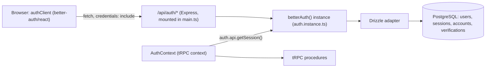

# Authentication

The project uses [Better Auth](https://better-auth.com) for sign-up, login, sessions, and
password reset. It satisfies the subject's baseline requirement of "basic sign-up and login with
encrypted credentials" (see [Subject](./SUBJECT.md)). OAuth (Google/GitHub/42, etc.) is a separate,
optional bonus module and is not implemented.

## How it's wired

Better Auth's backend instance lives in `apps/backend/src/auth/`:

| File                      | Purpose                                                                                   |
| ------------------------- | ----------------------------------------------------------------------------------------- |
| `auth.constants.ts`       | `AUTH` DI token, mirroring `database.constants.ts`'s `DATABASE` token.                    |
| `auth.instance.ts`        | Builds the `betterAuth()` instance: Drizzle adapter, plugins, email/password config.      |
| `auth.module.ts`          | Provides `AUTH` via a factory injecting the existing `DATABASE` token.                    |
| `auth.context.ts`         | tRPC context provider; resolves the session for every tRPC request.                       |
| `protected.middleware.ts` | Reusable tRPC middleware that rejects requests with no session.                           |
| `admin.middleware.ts`     | Reusable tRPC middleware that accepts Better Auth's `admin` role and rejects other users. |



### Why the handler is mounted directly on Express

`main.ts` mounts Better Auth's handler on the raw Express instance:

```ts
app.use('/api/auth', toNodeHandler(app.get<Auth>(AUTH)));
```

Two details make this mounting non-obvious:

- **Body parsing.** Better Auth reads the raw request body itself. Nest's
  `NestFactory.create(AppModule)` normally auto-attaches Express's body parser globally before any
  app code runs, which would drain the body stream before Better Auth ever sees it. The app is
  created with `bodyParser: false`, and `express.json()`/`express.urlencoded()` are added back
  _after_ the Better Auth mount, only for every other route. Their 2 MB limit leaves headroom for
  the event image picker's compressed data-URL payloads.
- **Plain prefix, not a wildcard.** The mount uses the plain string `'/api/auth'`, not an
  Express 5 wildcard pattern like `'/api/auth/{*splat}'`. The wildcard form was tried first and
  broke query-string parsing specifically for Better Auth's password-reset redirect endpoint
  (`GET /reset-password/:token?callbackURL=...`): Express's wildcard-mount path rewriting produces
  a `req.url`/`req.baseUrl` combination that trips an edge case in `better-call`'s Node adapter
  (`constructRelativeUrl`), silently dropping the query string. A plain prefix mount only strips
  the literal `/api/auth` segment and doesn't hit that edge case.
- **CORS registration order.** `app.enableCors(...)` must be called _before_ the Better Auth
  mount. Better Auth's own router has no handler for a generic `OPTIONS` preflight request, so if
  it's mounted first it answers (with a 404) before Nest's CORS middleware gets a chance to.

In local development the frontend (`localhost:3000`) and backend (`localhost:3001`) are
different origins, so CORS is configured with `credentials: true`, and both the auth client and
the tRPC `httpBatchLink` send `credentials: 'include'` so the session cookie flows both ways.

In the Docker stack both sit behind Caddy on `https://localhost:3000`: the browser calls `/api/auth`
and `/api/trpc` on its own origin, `BETTER_AUTH_URL` is the HTTPS origin (which makes Better Auth
issue a `Secure`, `__Secure-`-prefixed session cookie), and `CORS_ORIGINS` is that same origin so
Better Auth's trusted-origin check passes. The frontend server reaches the backend directly via
`SERVER_URL` during SSR. See [Environment](./ENVIRONMENT.md#frontend) for how the URL is chosen.

## Schema

Better Auth's required tables extend the existing schema in
[`packages/schemas/src/database.ts`](../packages/schemas/src/database.ts) rather than living
separately, because `users` already has foreign keys from `events`, `friends`, and
`registrations`:

- `users` gained `emailVerified`, `updatedAt`, and `displayUsername` columns.
- Better Auth's admin plugin adds `role`, `banned`, `banReason`, and `banExpires` to `users`, plus
  `impersonatedBy` to `sessions`.
- New tables: `sessions`, `accounts`, `verifications` — Better Auth's standard shape. Notably, the
  hashed password lives in `accounts` (one row per sign-in method, `provider_id = 'credential'`
  for email/password), **not** on `users`.

All four tables use the same `uuid` primary key / `defaultRandom()` convention as the rest of the
schema, via `advanced.database.generateId: 'uuid'` in `auth.instance.ts`, which tells
Better Auth to let Postgres's `gen_random_uuid()` generate IDs instead of generating its own.

The `username` plugin (`better-auth/plugins`) is what makes the existing `username` column work
as a login credential: it validates the sign-up input, normalizes it for uniqueness, and adds the
`displayUsername` column to preserve the original casing shown in the UI.

The `admin` plugin is the only source of truth for application roles. Its default `user` and
`admin` roles are used by the navigation, admin route guard, and backend authorization.

## Dual user-creation paths

The backend currently has **two** independent ways to create a `users` row:

1. **Better Auth's `/sign-up/email`** — the real signup path, used by `/create-account`. Sets a
   hashed password, `username`, `emailVerified`, etc.
2. **The legacy `users.createUser` tRPC mutation** ([users.router.ts](../apps/backend/src/users/users.router.ts))
   — predates Better Auth, takes only `email`/`name`/`username`, and never sets a password. It
   still powers the `/example` page and is left untouched deliberately, rather than merged with
   Better Auth's signup.

This means a user created via `/example`'s form has no password and cannot log in through
`/login`. The legacy create/delete procedures and user subscriptions are admin-only; `getUsers`
requires a session, and `updateUser` accepts only the account owner or an administrator.

## Password reset (development)

The password recovery workflow uses an event-driven lifecycle integrated directly with the notification layer.

When a recovery transaction is initialized via `authClient.requestPasswordReset`, Better Auth's backend engine captures the request, registers a security token in the database `verifications` table, and emits an internal `password.reset.requested` process event.

The background `NotificationListener` intercepts the event string token, maps the recipient's language preference using `resolveUserLocale()`, and invokes:

```ts
notificationService.sendPasswordResetEmail(toEmail, userName, resetUrl, lang);
```

The delivery framework routes the rich-text multilingual message block to the local **Mailpit** sandbox listener running on `localhost:1025`. Developers and evaluators can view, test, and inspect the delivery links in real time by opening the web console interface dashboard on **http://localhost:8025**.

Opening the secure link from the sandboxed inbox validates the token cryptographic signatures against the database. The backend then issues a 302-redirect to the frontend's `/reset-password?token=...` page view. The token value is extracted from the URL query parameters by TanStack Router, staging it invisibly for the final password mutation submission back to the server.

## Frontend usage

The client lives in `apps/frontend/src/lib/auth-client.ts` (`better-auth/react` with
`usernameClient()`, `twoFactorClient()`, and `adminClient()`). Common calls:

```ts
authClient.signUp.email({ name, email, username, password });
authClient.signIn.email({ email, password });
authClient.signIn.username({ username, password });
authClient.signOut();
authClient.useSession(); // { data, isPending, error }
authClient.requestPasswordReset({ email, redirectTo });
authClient.resetPassword({ newPassword, token });
authClient.admin.listUsers({ query: { limit: 100 } });
authClient.admin.updateUser({ userId, data });
authClient.admin.setRole({ userId, role: 'admin' });
authClient.admin.removeUser({ userId });
```

The root route loads the session with the `getAuthSession` TanStack server function and exposes it
through route context. It forwards the incoming request cookie and uses `SERVER_URL` to reach the
backend from the frontend server. The navbar and protected route guards consume that shared
server-loaded session, so an authenticated hard refresh is rendered correctly before hydration.

After sign-up, login, two-factor verification, or logout, the initiating component invalidates the
router. That refreshes the root session context without reverting route protection to a
client-only loading state. `UserMenu.tsx` still performs logout through `authClient.signOut()`;
the destination document is then invalidated to update the shared session.

## Environment variables

See [Environment](./ENVIRONMENT.md) for `BETTER_AUTH_SECRET` and `BETTER_AUTH_URL`.
