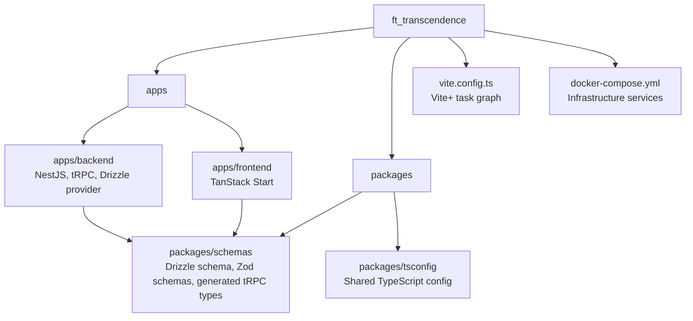

# Monorepo

The repository is a Vite+ managed monorepo.

The monorepo setup follows the Vite+ guide:

```text
https://viteplus.dev/guide/monorepo
```

## Workspaces

| Path                | Purpose                                                               |
| ------------------- | --------------------------------------------------------------------- |
| `apps/backend`      | NestJS backend and tRPC router implementation.                        |
| `apps/frontend`     | TanStack Start frontend.                                              |
| `packages/schemas`  | Shared database schema, validation schemas, and generated tRPC types. |
| `packages/tsconfig` | Shared TypeScript configuration.                                      |

## Root Configuration

The main repository task graph is configured in:

```text
vite.config.ts
```

This file defines development, build, test, check, database, and generation tasks.

For command details, see [Tooling](./TOOLING.md).


