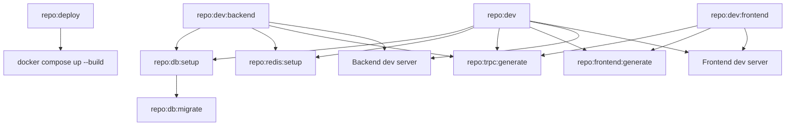

# Tooling

The project uses Vite+ as the unified local toolchain.

Vite+ manages:

1. Workspace dependency installation.
2. Bun runtime and package manager usage.
3. Development task orchestration.
4. Formatting, linting, and typechecking.
5. Test execution.
6. Commit hooks.
7. Generated artifacts such as tRPC router types.

## Install

Install Vite+ before running the project outside the devcontainer.

### macOS / Linux

```bash
curl -fsSL https://vite.plus | bash
```

### Windows PowerShell

```powershell
irm https://vite.plus/ps1 | iex
```

Then install project dependencies:

```bash
vp install
```

## Common Commands

| Command                  | Purpose                                                        |
| ------------------------ | -------------------------------------------------------------- |
| `vp run dev`             | Start the full local development stack.                        |
| `vp run dev:frontend`    | Start only the frontend.                                       |
| `vp run dev:backend`     | Start the database setup and backend.                          |
| `vp run deploy`          | Build and run the full Docker Compose stack.                   |
| `vp run deploy:detached` | Build and run the full Docker Compose stack in the background. |
| `vp run build`           | Build all workspaces.                                          |
| `vp run test`            | Run all tests.                                                 |
| `vp run check`           | Run formatting, linting, and type checks.                      |
| `vp run check:fix`       | Fix formatting and safe lint issues where possible.            |
| `vp run lint`            | Run lint checks.                                               |
| `vp run fmt`             | Check formatting.                                              |
| `vp run fmt:fix`         | Write formatting changes.                                      |
| `vp run trpc:generate`   | Regenerate the shared tRPC router types.                       |
| `vp run trpc:watch`      | Watch backend tRPC changes and regenerate types.               |
| `vp run db:setup`        | Start PostgreSQL and run migrations.                           |
| `vp run redis:setup`     | Start Redis through Docker Compose.                            |
| `vp run db:generate`     | Generate Drizzle migration files.                              |
| `vp run db:migrate`      | Run Drizzle migrations.                                        |
| `vp run db:push`         | Push schema changes directly to the database.                  |
| `vp run db:studio`       | Open Drizzle Studio.                                           |

Vite+ installs and manages Bun for the project, so contributors do not need to install Bun manually.

## Task Configuration

Workspace tasks are configured in:

```text
vite.config.ts
```

This file defines the repository task graph, including dependencies such as:

- generating tRPC types before frontend/backend tasks that need them;
- starting PostgreSQL, Redis, and database migrations before backend development;
- building and running the full containerized deployment stack;
- running frontend route and localization generation before frontend development.



## Generated Files

Generated files should not be edited by hand.

Important generated paths include:

| Path                                        | Generated By                     |
| ------------------------------------------- | -------------------------------- |
| `packages/schemas/src/@generated/server.ts` | `vp run trpc:generate`           |
| `apps/frontend/src/routeTree.gen.ts`        | frontend route generation        |
| `apps/frontend/src/@generated/paraglide`    | frontend localization generation |

## CI And Hooks

The pre-commit hook runs staged checks through Vite+.

GitHub Actions runs:

```bash
vp install --frozen-lockfile
vp run -w repo:check
vp run -w repo:test
vp run -w repo:build
```

See [Commit Hooks](./COMMIT_HOOKS.md) and [CI](./CI.md).
