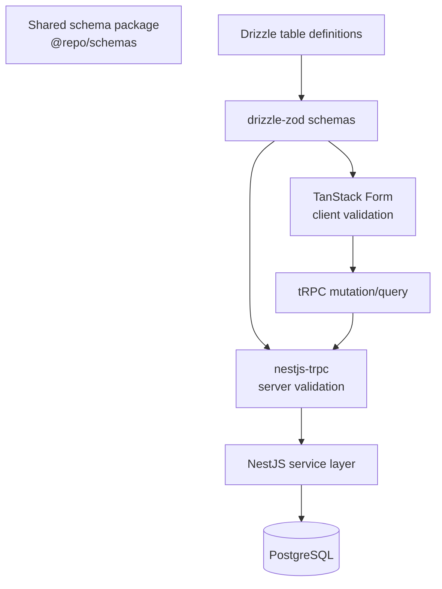

# Validation

The application uses a shared schema-first validation architecture to keep frontend and backend behavior consistent.

## Flow

1. Drizzle table definitions live in `packages/schemas/src/database.ts`.
2. Zod schemas are derived from those definitions with `drizzle-zod`.
3. TanStack Form uses the shared schema for instant client-side validation.
4. tRPC sends validated input to the backend.
5. `nestjs-trpc` validates the request again on the server.
6. The NestJS service layer reads or writes data through Drizzle ORM.
7. PostgreSQL stores the persistent data.

Output schemas that can receive Redis-cached database records must also account for cache
serialization. Keyv serializes JavaScript `Date` values as ISO strings, so `userSchema` explicitly
coerces `createdAt`, `updatedAt`, and nullable `banExpires` back to `Date` before tRPC validates and
returns the response.

## Why This Matters

- Validation is fast on the client.
- Validation cannot be bypassed on the server.
- Request contracts are shared instead of duplicated.
- Database schema, API inputs, and UI forms stay aligned.

For database details, see [Database](./DATABASE.md).
