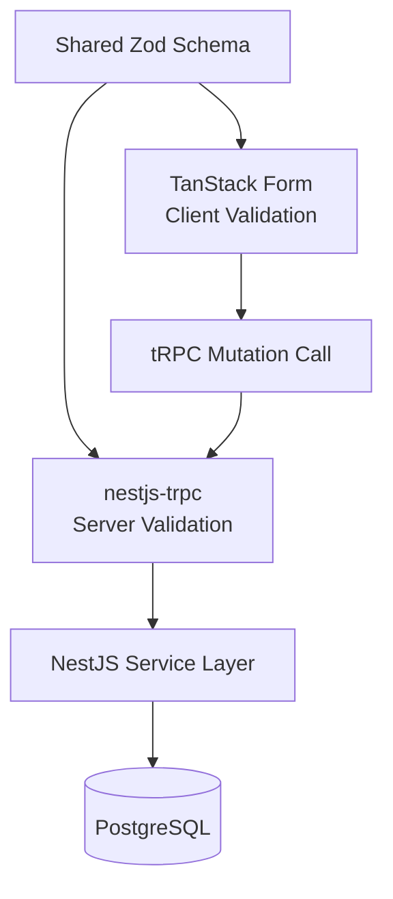

## Validation & Request Flow

The application uses a shared schema-first validation architecture to guarantee consistency between the frontend and backend.

### Flow

1. A shared **Zod schema** defines the request contract.
2. **TanStack Form** performs client-side validation using the same schema.
3. Valid data is submitted through a **tRPC mutation**.
4. **nestjs-trpc** validates the request again on the server using the shared schema.
5. The request reaches the **NestJS service layer**.
6. The service interacts with **PostgreSQL**, **Redis**, external APIs, or other infrastructure as required.